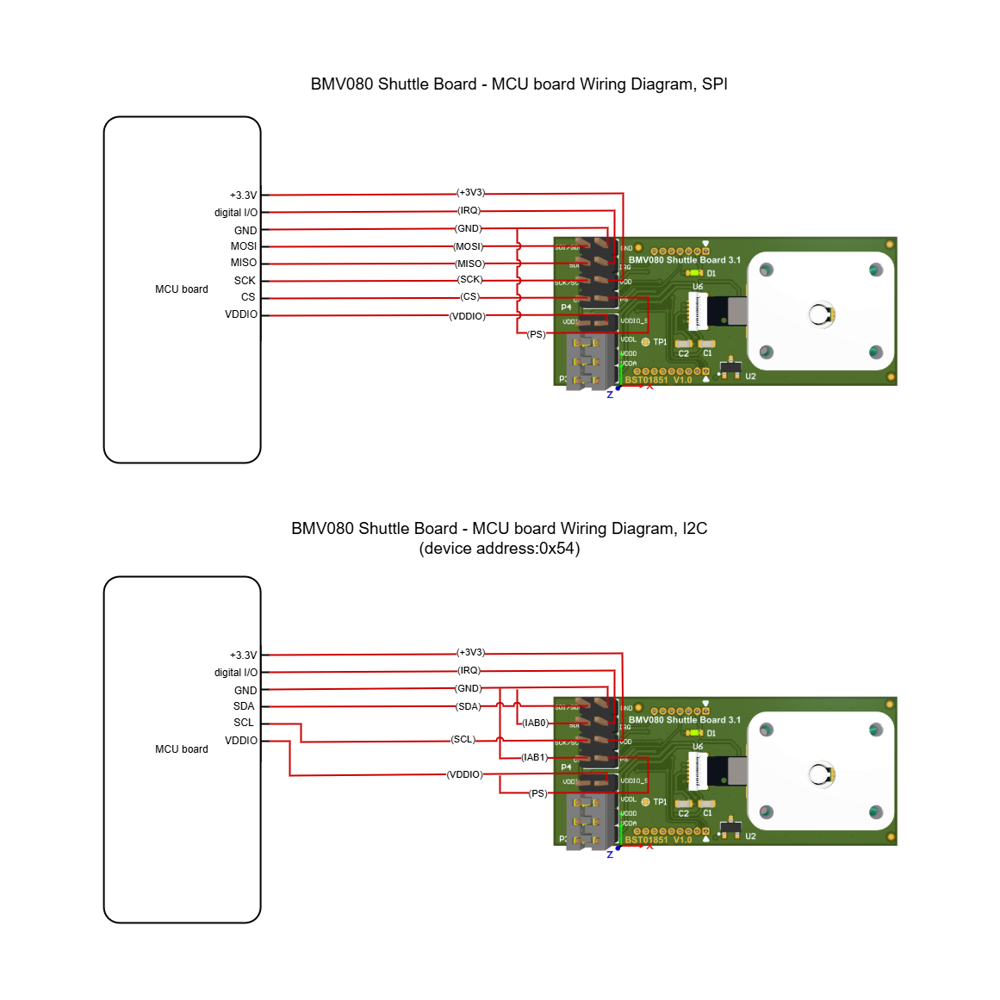
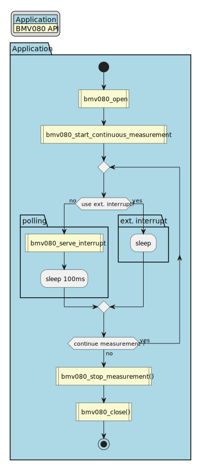
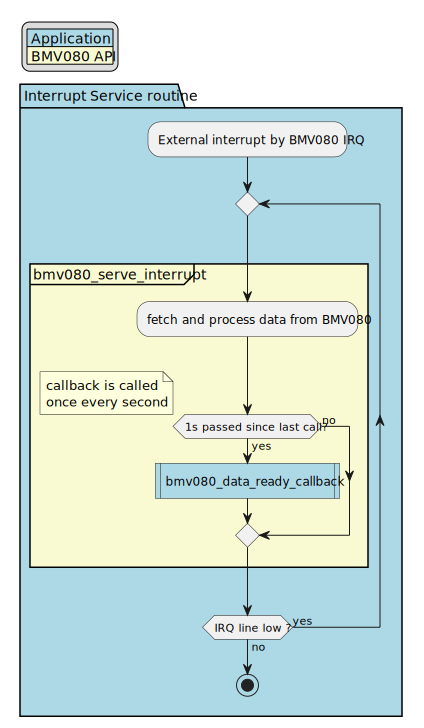
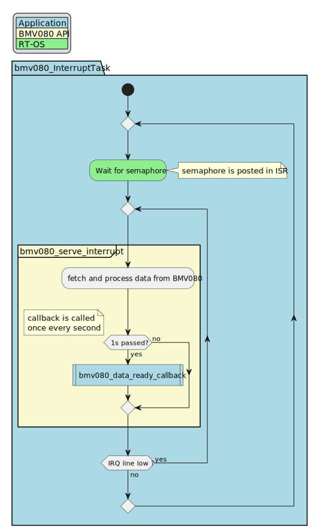
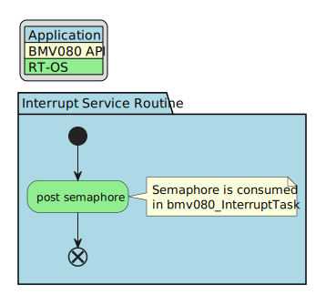

# Table of Contents
- [Table of Contents](#table-of-contents)
- [1 Introduction](#1-introduction)
- [2 Getting Started](#2-getting-started)
  - [2.1 Deliverables](#21-deliverables)
- [3 Platform Support](#3-platform-support)
  - [3.1 Common Example Output Structure](#31-common-example-output-structure)
  - [3.2 Generic Wiring Diagram](#32-generic-wiring-diagram)
  - [3.3 Platform Support for Embedded Targets](#33-platform-support-for-embedded-targets)
    - [3.3.1 Prerequisites](#331-prerequisites)
      - [3.3.1.1 Embedded Platforms](#3311-embedded-platforms)
      - [3.3.1.2 Raspberry Pi](#3312-raspberry-pi)
    - [3.3.2 Custom Serial Communication Target](#332-custom-serial-communication-target)
    - [3.3.3 Using External Interrupt vs Polling](#333-using-external-interrupt-vs-polling)
      - [3.3.3.1 Systems without a Real-Time OS (Bare Metal)](#3331-systems-without-a-real-time-os-bare-metal)
      - [3.3.3.2 Systems with a Real-Time OS](#3332-systems-with-a-real-time-os)
    - [3.3.4 Running ARM Cortex-M4 and Cortex-M4F Example](#334-running-arm-cortex-m4-and-cortex-m4f-example)
      - [3.3.4.1 Code Compilation](#3341-code-compilation)
      - [3.3.4.2 Upload and Execute Application](#3342-upload-and-execute-application)
    - [3.3.5 Running ARM Cortex-M33F Example](#335-running-arm-cortex-m33f-example)
      - [3.3.5.1 Code Compilation](#3351-code-compilation)
      - [3.3.5.2 Upload and Execute Application](#3352-upload-and-execute-application)
    - [3.3.6 Running ARM Cortex-M0+ Example](#336-running-arm-cortex-m0-example)
      - [3.3.6.1 Code Compilation](#3361-code-compilation)
      - [3.3.6.2 Upload and Execute Application](#3362-upload-and-execute-application)
    - [3.3.7 Running ARM Cortex-M7F Example](#337-running-arm-cortex-m7f-example)
      - [3.3.7.1 Code Compilation](#3371-code-compilation)
      - [3.3.7.2 Upload and Execute Application](#3372-upload-and-execute-application)
    - [3.3.8 Running Xtensa ESP32 Example](#338-running-xtensa-esp32-example)
      - [3.3.8.1 Code Compilation](#3381-code-compilation)
      - [3.3.8.2 Upload and Execute Application](#3382-upload-and-execute-application)
    - [3.3.9 Running Raspberry Pi Example](#339-running-raspberry-pi-example)
      - [3.3.9.1 Code Compilation](#3391-code-compilation)
      - [3.3.9.2 Upload and Execute Application](#3392-upload-and-execute-application)
    - [3.3.10 Running BST Application Board Example](#3310-running-bst-application-board-example)
      - [3.3.10.1 Code Compilation](#33101-code-compilation)
      - [3.3.10.2 Upload and Execute Application](#33102-upload-and-execute-application)
  - [3.4 Platform Support for General Purpose Targets](#34-platform-support-for-general-purpose-targets)
    - [3.4.1 Prerequisites](#341-prerequisites)
    - [3.4.2 Custom Serial Communication Target](#342-custom-serial-communication-target)
    - [3.4.3 Running x64 \& x86 Example](#343-running-x64--x86-example)
      - [3.4.3.1 Code Compilation](#3431-code-compilation)
      - [3.4.3.2 Execution](#3432-execution)
  - [3.5 Evaluation Applications](#35-evaluation-applications)
    - [3.5.1 Web App](#351-web-app)
      - [3.5.1.1 Preparation](#3511-preparation)
      - [3.5.1.2 Usage](#3512-usage)
- [4 Errata](#4-errata)
  - [4.1 Incorrect PlatformIO Upload Status Message](#41-incorrect-platformio-upload-status-message)
  - [4.2 ESP32-S3 Feather Board Workaround to Support 400 kHz I2C Communication](#42-esp32-s3-feather-board-workaround-to-support-400-khz-i2c-communication)
  - [4.3 ESP32-S3 Feather Board does not Support 1 MHz I2C Communication](#43-esp32-s3-feather-board-does-not-support-1-mhz-i2c-communication)
  - [4.4 ESP32-S2 Feather Board does not Support 1 MHz I2C Communication](#44-esp32-s2-feather-board-does-not-support-1-mhz-i2c-communication)
  - [4.5 Limitations in ArduinoCore-renesas I2C Implementation for Portenta C33 Board](#45-limitations-in-arduinocore-renesas-i2c-implementation-for-portenta-c33-board)
  - [4.6 Limitations in ArduinoCore-renesas SPI Mode 3 Implementation for Portenta C33 Board](#46-limitations-in-arduinocore-renesas-spi-mode-3-implementation-for-portenta-c33-board)
  - [4.7 Initial Measurement Delay](#47-initial-measurement-delay)
  - [4.8 ArduinoCore-Renesas on Portenta C33 Board cannot use external interrupt](#48-arduinocore-renesas-on-portenta-c33-board-cannot-use-external-interrupt)
  - [4.9 Compilation and upload issue for ESP32 variants](#49-compilation-and-upload-issue-for-esp32-variants)
  - [4.10 Misleading PlatformIO upload status message for ESP32-S2](#410-misleading-platformio-upload-status-message-for-esp32-s2)

# 1 Introduction
The BMV080 sensor driver is the interface between the sensor hardware and the user application running on the host system. The complete sensor driver is provided by Bosch Sensortec to run on the host microcontroller / processor.
The sensor driver offers high-level and feature-oriented Application Programming Interfaces (APIs), hiding the peripheral complexity to the user application developers. It includes a complete set of ready-to-use APIs in order to simplify the development of a user application. These functions can be easily used to develop an user application for a determined use case.

The BMV080 Software Development Kit (SDK) includes the BMV080 sensor driver along with examples for some supported hardware platforms to demonstrate the usage of the BMV080 API and to ease the software integration effort within the user application.

Please refer to the following documents to gather further information about BMV080 specifications.
* BMV080 Datasheet

# 2 Getting Started
## 2.1 Deliverables
The BMV080 Software Development Kit (SDK) contains the files listed below which covers a generic API example to instrument the BMV080 sensor unit, as well as examples to be used on the Evaluation Kits. These examples serve as a base for rapid prototyping and should be adjusted for a specific target application.

Folder structure of the BMV080 SDK is as follows:

- ```api\doc\bmv080.7z```	Documentation of BMV080 sensor driver in HTML format, 7z compressed
- ```api\doc\bmv080.chm``` Documentation of BMV080 sensor driver as Compiled Help Module
- ```api\inc\*.h``` Header files of BMV080 sensor driver
- ```api\lib\arm_cortex_m4f\arm_none_eabi_gcc\release\*``` Library files of BMV080 sensor driver for ARM Cortex-M4F architecture with full hardware floating-point support. using the ARM GCC compiler
- ```api\lib\arm_cortex_m4\arm_none_eabi_gcc\release\*``` Library files of BMV080 sensor driver for ARM Cortex-M4 architecture with full software floating-point support, using the ARM GCC compiler
- ```api\lib\arm_cortex_m33f\arm_none_eabi_gcc\release\*``` Library files of BMV080 sensor driver for ARM Cortex-M33F architecture with full hardware floating-point support, using the ARM GCC compiler
- ```api\lib\arm_cortex_m33\arm_none_eabi_gcc\release\*``` Library files of BMV080 sensor driver for ARM Cortex-M33 architecture with full software floating-point support, using the ARM GCC compiler
- ```api\lib\arm_cortex_m0plus\arm_none_eabi_gcc\release\*``` Library files of BMV080 sensor driver for ARM Cortex-M0plus architecture with full software floating-point support, using the ARM GCC compiler
- ```api\lib\arm_cortex_m7f\arm_none_eabi_gcc\release\*``` Library files of BMV080 sensor driver for ARM Cortex-M7F architecture with full software floating-point support, using the ARM GCC compiler
- ```api\lib\raspberry_pi\armv6\arm-linux-gnueabihf-gcc\release\*``` Library files of BMV080 sensor driver for Raspberry Pi ARMv6 32-bit using the SYS GCC compiler
- ```api\lib\raspberry_pi\armv8-a\arm-linux-gnueabihf-gcc\release\*``` Library files of BMV080 sensor driver for Raspberry Pi ARMv8-a 32-bit using the SYS GCC compiler
- ```api\lib\raspberry_pi\armv8-a\aarch64-linux-gnu-gcc\release\*``` Library files of BMV080 sensor driver for Raspberry Pi ARMv8-a 64-bit using the SYS GCC compiler
- ```api\lib\x64\msvc\release\*``` Library files of BMV080 sensor driver for x64 architecture using the Microsoft Visual C++ compiler
- ```api\lib\x86\msvc\release\*``` Library files of BMV080 sensor driver for x86 architecture using the Microsoft Visual C++ compiler
- ```api\lib\xtensa_esp32\xtensa_esp32_elf_gcc\release\*``` Library files of BMV080 sensor driver for Xtensa ESP32, using the Xtensa ELF GCC compiler
- ```api\lib\xtensa_esp32s2\xtensa_esp32s2_elf_gcc\release\*``` Library files of BMV080 sensor driver for Xtensa ESP32-S2, using the Xtensa ELF GCC compiler
- ```api\lib\xtensa_esp32s3\xtensa_esp32s3_elf_gcc\release\*``` Library files of BMV080 sensor driver for Xtensa ESP32-S3, using the Xtensa ELF GCC compiler
- ```api\lib\riscv_rv32imc\riscv_none_elf_gcc\release\*``` Library files of BMV080 sensor driver for RISC-V RV32IMC instruction set architecture, using the [GCC compiler](https://github.com/xpack-dev-tools/riscv-none-elf-gcc-xpack/releases/download/v12.3.0-2/xpack-riscv-none-elf-gcc-12.3.0-2-win32-x64.zip) 
- ```api\lib\riscv_rv32imafc\riscv_none_elf_gcc\release\*``` Library files of BMV080 sensor driver for RISC-V RV32IMAFC, using the [GCC compiler](https://github.com/xpack-dev-tools/riscv-none-elf-gcc-xpack/releases/download/v12.3.0-2/xpack-riscv-none-elf-gcc-12.3.0-2-win32-x64.zip) 
- ```api_examples\_common\*``` Common files used by all the platform specific applications, showing the usage of the BMV080 APIs:
     -   bmv080_open
     -   bmv080_get_driver_version
     -   bmv080_get_sensor_id
     -   bmv080_get_parameter
     -   bmv080_set_parameter
     -   bmv080_start_continuous_measurement
     -   bmv080_start_duty_cycling_measurement 
     -   bmv080_serve_interrupt
     -   bmv080_stop_measurement
     -   bmv080_close
- ```api_examples\arm_cortex_m4_m4f\*```	Example application for ARM Cortex-M4 and ARM Cortex-M4F as a PlatformIO project.
- ```api_examples\arm_cortex_m33f\*```	Example application for ARM Cortex-M33F as a PlatformIO project. 
- ```api_examples\arm_cortex_m0plus\*```	Example application for ARM Cortex-M0+ as a PlatformIO project.
- ```api_examples\arm_cortex_m7f\*```	Example application for ARM Cortex-M7F as a PlatformIO project.
- ```api_examples\bst_application_board\*```	Example application for BST application board based on ARM Cortex-M4F as a makefile project. 
- ```api_examples\raspberry_pi\*```	Example application for Raspberry Pi as a CMake project. 
- ```api_examples\x86_x64\*```	Example application for x86 / x64 with Windows OS as a CMake project.
- ```api_examples\xtensa_esp32\*```	Example application for ESP32, ESP32-S2, ESP32-S3 and ESP32-C6 as a PlatformIO project.
- ```apps\web_app_bst_application_board\*```	Web application for the BST application board that offers a user interface to configure the sensor, perform measurements, and visualize sensor data. 
- ```README.md```	This file contains general information about this SDK
- ```CHANGELOG.md```	This file contains a curated, reverse chronologically ordered list of notable changes for each version of BMV080 SDK
- ```LICENSE.md```	This file contains the license of BMV080 SDK
# 3 Platform Support
## 3.1 Common Example Output Structure
The BMV080 SDK has a unified structure for its example output, which simplifies development activities. Assuming the serial port settings are configured to be compatible with the host platform, the serial console output of the application will appear the same across all platforms supported by the BMV080 SDK. However, it is important to note that certain initial boot messages may be printed from different platforms, which are not included in the example provided below.

```
BMV080 sensor driver version: vX.Y.Z.A.B
Sensor ID: HLXXXXXXXXXX

Get parameters
Default integration_time: 10.0 s
Default measurement_algorithm: 3
Default do_obstruction_detection: true
Default do_vibration_filtering: false

Set parameters
Customized integration_time: 10.0 s
Customized measurement_algorithm: 3
Customized do_obstruction_detection: true
Customized do_vibration_filtering: false

Particle measurement started in continuous mode for 60 seconds
Runtime: 1.90 s, PM2.5: 0 ug/m^3, PM1: 0 ug/m^3, PM10: 0 ug/m^3, obstructed: no, outside measurement range: no
Runtime: 2.93 s, PM2.5: 0 ug/m^3, PM1: 0 ug/m^3, PM10: 0 ug/m^3, obstructed: no, outside measurement range: no
Runtime: 3.96 s, PM2.5: 0 ug/m^3, PM1: 0 ug/m^3, PM10: 0 ug/m^3, obstructed: no, outside measurement range: no
Runtime: 4.99 s, PM2.5: 0 ug/m^3, PM1: 0 ug/m^3, PM10: 0 ug/m^3, obstructed: no, outside measurement range: no
Runtime: 6.02 s, PM2.5: 0 ug/m^3, PM1: 0 ug/m^3, PM10: 0 ug/m^3, obstructed: no, outside measurement range: no
Runtime: 7.05 s, PM2.5: 0 ug/m^3, PM1: 0 ug/m^3, PM10: 0 ug/m^3, obstructed: no, outside measurement range: no
Runtime: 8.08 s, PM2.5: 0 ug/m^3, PM1: 0 ug/m^3, PM10: 0 ug/m^3, obstructed: no, outside measurement range: no
Runtime: 9.11 s, PM2.5: 0 ug/m^3, PM1: 0 ug/m^3, PM10: 0 ug/m^3, obstructed: no, outside measurement range: no
Runtime: 10.14 s, PM2.5: 0 ug/m^3, PM1: 0 ug/m^3, PM10: 0 ug/m^3, obstructed: no, outside measurement range: no
Runtime: 11.17 s, PM2.5: 0 ug/m^3, PM1: 0 ug/m^3, PM10: 0 ug/m^3, obstructed: no, outside measurement range: no
Runtime: 12.20 s, PM2.5: 0 ug/m^3, PM1: 0 ug/m^3, PM10: 0 ug/m^3, obstructed: no, outside measurement range: no
Runtime: 13.23 s, PM2.5: 12 ug/m^3, PM1: 5 ug/m^3, PM10: 16 ug/m^3, obstructed: no, outside measurement range: no
Runtime: 14.26 s, PM2.5: 12 ug/m^3, PM1: 5 ug/m^3, PM10: 16 ug/m^3, obstructed: no, outside measurement range: no
Runtime: 15.28 s, PM2.5: 11 ug/m^3, PM1: 5 ug/m^3, PM10: 15 ug/m^3, obstructed: no, outside measurement range: no
Runtime: 16.31 s, PM2.5: 11 ug/m^3, PM1: 5 ug/m^3, PM10: 15 ug/m^3, obstructed: no, outside measurement range: no
Runtime: 17.34 s, PM2.5: 12 ug/m^3, PM1: 5 ug/m^3, PM10: 16 ug/m^3, obstructed: no, outside measurement range: no
Runtime: 18.37 s, PM2.5: 9 ug/m^3, PM1: 4 ug/m^3, PM10: 12 ug/m^3, obstructed: no, outside measurement range: no
Runtime: 19.40 s, PM2.5: 10 ug/m^3, PM1: 4 ug/m^3, PM10: 13 ug/m^3, obstructed: no, outside measurement range: no
Runtime: 20.43 s, PM2.5: 11 ug/m^3, PM1: 5 ug/m^3, PM10: 15 ug/m^3, obstructed: no, outside measurement range: no
Runtime: 21.46 s, PM2.5: 11 ug/m^3, PM1: 5 ug/m^3, PM10: 15 ug/m^3, obstructed: no, outside measurement range: no
Runtime: 22.49 s, PM2.5: 12 ug/m^3, PM1: 5 ug/m^3, PM10: 16 ug/m^3, obstructed: no, outside measurement range: no
Runtime: 23.52 s, PM2.5: 8 ug/m^3, PM1: 3 ug/m^3, PM10: 10 ug/m^3, obstructed: no, outside measurement range: no
Runtime: 24.55 s, PM2.5: 7 ug/m^3, PM1: 3 ug/m^3, PM10: 9 ug/m^3, obstructed: no, outside measurement range: no
Runtime: 25.58 s, PM2.5: 8 ug/m^3, PM1: 3 ug/m^3, PM10: 10 ug/m^3, obstructed: no, outside measurement range: no
Runtime: 26.61 s, PM2.5: 11 ug/m^3, PM1: 5 ug/m^3, PM10: 15 ug/m^3, obstructed: no, outside measurement range: no
Runtime: 27.64 s, PM2.5: 10 ug/m^3, PM1: 4 ug/m^3, PM10: 13 ug/m^3, obstructed: no, outside measurement range: no
Runtime: 28.67 s, PM2.5: 9 ug/m^3, PM1: 4 ug/m^3, PM10: 12 ug/m^3, obstructed: no, outside measurement range: no
Runtime: 29.70 s, PM2.5: 5 ug/m^3, PM1: 2 ug/m^3, PM10: 6 ug/m^3, obstructed: no, outside measurement range: no
Runtime: 30.73 s, PM2.5: 4 ug/m^3, PM1: 1 ug/m^3, PM10: 5 ug/m^3, obstructed: no, outside measurement range: no
Runtime: 31.76 s, PM2.5: 5 ug/m^3, PM1: 2 ug/m^3, PM10: 6 ug/m^3, obstructed: no, outside measurement range: no
Runtime: 32.79 s, PM2.5: 4 ug/m^3, PM1: 1 ug/m^3, PM10: 5 ug/m^3, obstructed: no, outside measurement range: no
Runtime: 33.82 s, PM2.5: 4 ug/m^3, PM1: 1 ug/m^3, PM10: 5 ug/m^3, obstructed: no, outside measurement range: no
Runtime: 34.85 s, PM2.5: 4 ug/m^3, PM1: 1 ug/m^3, PM10: 5 ug/m^3, obstructed: no, outside measurement range: no
Runtime: 35.88 s, PM2.5: 3 ug/m^3, PM1: 1 ug/m^3, PM10: 4 ug/m^3, obstructed: no, outside measurement range: no
Runtime: 36.91 s, PM2.5: 2 ug/m^3, PM1: 0 ug/m^3, PM10: 2 ug/m^3, obstructed: no, outside measurement range: no
Runtime: 37.94 s, PM2.5: 2 ug/m^3, PM1: 0 ug/m^3, PM10: 2 ug/m^3, obstructed: no, outside measurement range: no
Runtime: 38.97 s, PM2.5: 3 ug/m^3, PM1: 1 ug/m^3, PM10: 4 ug/m^3, obstructed: no, outside measurement range: no
Runtime: 40.00 s, PM2.5: 5 ug/m^3, PM1: 2 ug/m^3, PM10: 6 ug/m^3, obstructed: no, outside measurement range: no
Runtime: 41.03 s, PM2.5: 7 ug/m^3, PM1: 3 ug/m^3, PM10: 9 ug/m^3, obstructed: no, outside measurement range: no
Runtime: 42.06 s, PM2.5: 7 ug/m^3, PM1: 3 ug/m^3, PM10: 9 ug/m^3, obstructed: no, outside measurement range: no
Runtime: 43.09 s, PM2.5: 7 ug/m^3, PM1: 3 ug/m^3, PM10: 9 ug/m^3, obstructed: no, outside measurement range: no
Runtime: 44.12 s, PM2.5: 7 ug/m^3, PM1: 3 ug/m^3, PM10: 9 ug/m^3, obstructed: no, outside measurement range: no
Runtime: 45.15 s, PM2.5: 7 ug/m^3, PM1: 3 ug/m^3, PM10: 9 ug/m^3, obstructed: no, outside measurement range: no
Runtime: 46.18 s, PM2.5: 7 ug/m^3, PM1: 3 ug/m^3, PM10: 9 ug/m^3, obstructed: no, outside measurement range: no
Runtime: 47.21 s, PM2.5: 7 ug/m^3, PM1: 3 ug/m^3, PM10: 9 ug/m^3, obstructed: no, outside measurement range: no
Runtime: 48.23 s, PM2.5: 7 ug/m^3, PM1: 3 ug/m^3, PM10: 9 ug/m^3, obstructed: no, outside measurement range: no
Runtime: 49.26 s, PM2.5: 6 ug/m^3, PM1: 2 ug/m^3, PM10: 8 ug/m^3, obstructed: no, outside measurement range: no
Runtime: 50.29 s, PM2.5: 3 ug/m^3, PM1: 1 ug/m^3, PM10: 4 ug/m^3, obstructed: no, outside measurement range: no
Runtime: 51.32 s, PM2.5: 4 ug/m^3, PM1: 1 ug/m^3, PM10: 5 ug/m^3, obstructed: no, outside measurement range: no
Runtime: 52.35 s, PM2.5: 3 ug/m^3, PM1: 1 ug/m^3, PM10: 4 ug/m^3, obstructed: no, outside measurement range: no
Runtime: 53.38 s, PM2.5: 3 ug/m^3, PM1: 1 ug/m^3, PM10: 4 ug/m^3, obstructed: no, outside measurement range: no
Runtime: 54.41 s, PM2.5: 4 ug/m^3, PM1: 1 ug/m^3, PM10: 5 ug/m^3, obstructed: no, outside measurement range: no
Runtime: 55.44 s, PM2.5: 5 ug/m^3, PM1: 2 ug/m^3, PM10: 6 ug/m^3, obstructed: no, outside measurement range: no
Runtime: 56.47 s, PM2.5: 5 ug/m^3, PM1: 2 ug/m^3, PM10: 6 ug/m^3, obstructed: no, outside measurement range: no
Runtime: 57.50 s, PM2.5: 10 ug/m^3, PM1: 4 ug/m^3, PM10: 13 ug/m^3, obstructed: no, outside measurement range: no
Runtime: 58.53 s, PM2.5: 10 ug/m^3, PM1: 4 ug/m^3, PM10: 13 ug/m^3, obstructed: no, outside measurement range: no
Particle measurement stopped

Default duty_cycling_period: 30 s
Customized duty_cycling_period: 20 s

Particle measurement started in duty cycling mode for 60 seconds
Runtime: 11.17 s, PM2.5: 2 ug/m^3, PM1: 0 ug/m^3, PM10: 2 ug/m^3, obstructed: no, outside measurement range: no
Runtime: 31.17 s, PM2.5: 7 ug/m^3, PM1: 3 ug/m^3, PM10: 9 ug/m^3, obstructed: no, outside measurement range: no
Runtime: 51.17 s, PM2.5: 5 ug/m^3, PM1: 2 ug/m^3, PM10: 6 ug/m^3, obstructed: no, outside measurement range: no
Particle measurement stopped
```
## 3.2 Generic Wiring Diagram
The BMV080 shuttle board 3.1 features P3 and P4 connection headers, allowing it to interface with base boards other than the BST Application Board 3.1. 
A generic wiring diagram demonstrating how to connect the pins from the shuttle board headers is shown below:
 

Note that the jumper on P3 between VDDIO and VDDIO_S is removed, while the jumpers for the other pins remain in place.

## 3.3 Platform Support for Embedded Targets

| Platform | API [library] | API [Example] | API Example Support | Example Board | Example Board Overview | Architecture | Operating System            |
|---------------|---------------|---------------|---------------|---------------|---------------|---------------|---------------|
| ARM Cortex M4F                                 | ✔️            | ✔️             | STM32F405RGT6       | [Adafruit Feather STM32F405 Express](https://www.adafruit.com/product/4382) | [Overview Page](https://learn.adafruit.com/adafruit-stm32f405-feather-express) | Armv7-M                     | Bare Metal                 |
| ARM Cortex M4                                  | ✔️            | ✔️             | STM32F405RGT6       | [Adafruit Feather STM32F405 Express](https://www.adafruit.com/product/4382) | [Overview Page](https://learn.adafruit.com/adafruit-stm32f405-feather-express) | Armv7-M                     | Bare Metal                 |
| ARM Cortex M33F                                | ✔️            | ✔️             | R7FA6M5BH2CBG       | [Arduino Portenta C33](https://www.arduino.cc/pro/hardware-product-portenta-c33/) | [Overview page](https://store.arduino.cc/products/portenta-c33) | Armv8-M Mainline            | Bare Metal                 |
| ARM Cortex M0+                                 | ✔️            | ✔️             | RP2040              | [Adafruit Feather RP2040](https://www.adafruit.com/product/4884) | [Overview page](https://learn.adafruit.com/adafruit-feather-rp2040-pico) | Armv6-M                     | Mbed OS                 |
| ARM Cortex M7F                                 | ✔️            | ✔️             | NXP iMXRT1062              | [Teensy 4.0](https://www.pjrc.com/store/teensy40.html) | [Overview page](https://www.pjrc.com/store/teensy40_pins.html) | Armv7-M                     | Bare Metal                 |
| ESP32                                          | ✔️            | ✔️             | ESP32-PICO-MINI-02  | [Adafruit ESP32 Feather V2](https://www.adafruit.com/product/5400) | [Overview Page](https://learn.adafruit.com/adafruit-esp32-feather-v2) | Xtensa LX6                  | FreeRTOS                     |
| ESP32-S2                                       | ✔️            | ✔️             | ESP32-S2-MINI-1     | [Adafruit ESP32-S2 Feather](https://www.adafruit.com/product/5000) | [Overview page](https://learn.adafruit.com/adafruit-esp32-s2-feather/overview) | Xtensa LX7                  | FreeRTOS                     |
| ESP32-S3                                       | ✔️            | ✔️             | ESP32-S3-MINI-1     | [Adafruit ESP32-S3 Feather](https://www.adafruit.com/product/5477) | [Overview page](https://learn.adafruit.com/adafruit-esp32-s3-feather/overview) | Xtensa LX7                  | FreeRTOS                     |
| ESP32-C6                                       | ✔️            | ✔️             | ESP32-C6-WROOM-1     | [Espressif ESP32-C6-DevKitC-1](https://docs.espressif.com/projects/esp-dev-kits/en/latest/esp32c6/esp32-c6-devkitc-1/index.html) | [Overview page](https://docs.espressif.com/projects/esp-dev-kits/en/latest/esp32c6/esp32-c6-devkitc-1/user_guide.html#getting-started) | RISC-V RV32IMAC | FreeRTOS                     |
| Raspberry Pi Models | ✔️ | ✔️         |    Pi 3: BCM2837, Pi 4: BCM2711, Pi Zero: BCM2835, Pi Zero 2 W: BCM2710A1, Pi 5: BCM2712  | [Raspberry Pi 4B](https://www.raspberrypi.com/products/raspberry-pi-4-model-b/)   | [Overview Page](https://www.raspberrypi.com/documentation/computers/getting-started.html) | ARMv6, ARMv8 32-bit, ARMv8 64-bit | [Raspberry Pi OS Bookworm (Full/Lite, 32-bit/64-bit)](https://www.raspberrypi.com/software/operating-systems/)|
| BST Application Board | ✔️ | ✔️         | NINA-B302 with nRF52840 chipset | [Sensortec application board 3.1](https://www.bosch-sensortec.com/software-tools/tools/application-board-3-1/#order)   | [Overview Page](https://www.bosch-sensortec.com/software-tools/tools/application-board-3-1/) | Armv7-M | Bare  Metal|

Memory requirements (ROM and RAM) are outlined in _section 5.1 Host Requirements_ of the [BMV080 Datasheet](https://www.bosch-sensortec.com/products/environmental-sensors/particulate-matter-sensor/bmv080/#documents). Particular attention should be given to the stack memory needed for the BMV080 driver, especially for the bmv080_serve_interrupt API.

### 3.3.1 Prerequisites
#### 3.3.1.1 Embedded Platforms
PlatformIO is used as the build system for all supported embedded target platforms (except Raspberry Pi and BST application board). It also provisions all the dependencies required for build and deployment, including the compiler toolchain, support tools, and framework packages.
In order to compile one of the given examples using PlatformIO on a Windows 11 PC, the following prerequisites need to be fulfilled:

- Python Installation 
- Pip Installation
- PlatformIO Core Installation

Install Python for Windows via installer and Add Python 3.12 to the PATH environment variable.
  - [Python Release page](https://www.python.org/downloads/release/python-3128/)
  - [Python Direct download link](https://www.python.org/ftp/python/3.12.8/python-3.12.8-amd64.exe)

Confirm the installation of Python from command line as follows:
```
>python --version
Python 3.12.8
```

Update pip (package manager of Python) to the most recent version from the command line:

```
python -m pip install --upgrade pip
```

- Note: If you are using pip from a computer that is behind a proxy server, then you would need to configure the proxy settings accordingly. Please contact your IT services.

Install PlatformIO Core (CLI)
```
pip install platformio==6.1.17
```

Confirm the installation of PlatformIO from command line:
```
>platformio --version
PlatformIO, version 6.1.17
```

#### 3.3.1.2 Raspberry Pi
CMake is used as the build system for Raspberry Pi platforms.
In order to compile one of the given examples on a Windows 11 PC, the following prerequisites needs to be fulfilled:

- CMake Installation
- SYS GCC Installation

Install CMake for Windows via installer
  - [ Download Page - CMake for Windows x64](https://github.com/Kitware/CMake/releases/download/v3.28.1/cmake-3.28.1-windows-x86_64.msi/)

Install SYS GCC for Windows via installer
- 32 bit Platforms
  - [Download Page - raspberry-gcc10.2.1-r2](https://sysprogs.com/getfile/2076/raspberry-gcc10.2.1-r2.exe/)
- 64 bit Platforms
  - [Download Page - raspberry64-gcc10.2.1](https://sysprogs.com/getfile/1804/raspberry64-gcc10.2.1.exe)

  
### 3.3.2 Custom Serial Communication Target
Example source code for communicating with the BMV080 sensor over SPI or I2C protocols using vendor specific frameworks (e.g. STM32 HAL, ESP-IDF, etc.) have been provided along with this SDK. Users can modify this file to fit their needs, e.g. SPI clock speed, SPI channel configuration, I2C Clock Speed, I2C Address. More information about the SPI/I2C communication interface, can be found in the datasheet under section __4.4.2 Communication interface__.

In order to implement a custom serial communication target, functions need to be implemented of type `bmv080_callback_read_t`, `bmv080_callback_write_t` and `bmv080_callback_delay_t` as defined in `bmv080_defs.h`. The pointers to these functions are passed to the `bmv080_open` API to perform target specific sensor read, sensor write and system delay actions. Examples with respect to how this is best done can be found in file `combridge.c`.

### 3.3.3 Using External Interrupt vs Polling
In the following diagrams, you can see the activity diagram for continuous measurement. The light yellow parts are calls to the BMV080 API, and the light blue parts need to be implemented by the application. The sensor readings are obtained by calling the `bmv080_serve_interrupt` routine.  Once a second, the BMV080 will provide new measurement data by calling the function that is provided by the `bmv080_data_ready_callback*` function pointer. The `bmv080_serve_interrupt` routine can either be polled by calling it at least once a second, or the IRQ output from the BMV080 sensor can be used to trigger an external interrupt. Whenever the sensor has data that needs to be processed, it will pull the IRQ line low until the data is fetched. Therefore, the IRQ line should either be served by a level-triggered interrupt, or if an edge-triggered interrupt is used, the state of the IRQ line needs to be checked in the interrupt service routine, as shown in the diagram below.
The external interrupt should only be enabled after the successful initialization of the BMV080 by calling the `bmv080_open` API function. Similarly, the external interrupt should be disabled before calling the `bmv080_close` API function.
If the `USE_EXTERNAL_INTERRUPT` symbol is defined (see platformio.ini build_flags) the SDK will use the external Interrupt line instead of polling to call `bmv080_serve_interrupt`.

| Platform  | API Example Polling | API Example External Interrupt  |
| ---------------------- | --- | --- |
| M4F                    | ✔️ | ✔️ |
| M4                     | ✔️ | ✔️ |
| M33F                   | ✔️ | ❌ |
| M33                    | ❌ | ❌ |
| M0+                    | ✔️ | ✔️ |
| M7F                    | ✔️ | ✔️ |
| ESP32                  | ✔️ | ✔️ |
| ESP32-S2               | ✔️ | ✔️ |
| ESP32-S3               | ✔️ | ✔️ |
| ESP32-C6               | ✔️ | ✔️ |
| Raspberry Pi           | ✔️ | ❌ |
| BST Application Board  | ✔️ | ❌ |


#### 3.3.3.1 Systems without a Real-Time OS (Bare Metal)
For bare metal systems, the BMV080 sensor data can be processed directly within the Interrupt Service Routine (ISR). If `bmv080_serve_interrupt` is directly called from the ISR, the following points need to be considered:
* Set the interrupt priority of the ISR to a low level to prevent blocking other interrupts.
* Adjust the stack size for ISR routines to accommodate the requirements of the BMV080 API.

<table>
  <tr>
    <td> </td>
    </td>
    <td> </td>
    </td>
  </tr>
</table>

#### 3.3.3.2 Systems with a Real-Time OS
For systems operating on a real-time OS, data from the BMV080 sensor should not be processed directly within the interrupt service routine (ISR). Instead, it should be handled in a separate task. The diagrams below illustrate the basic flow of activities.

<table>
  <tr>
    <td> </td>
    </td>
    <td> </td>
    </td>
    <td> </td>
    </td>
  </tr>
</table>


### 3.3.4 Running ARM Cortex-M4 and Cortex-M4F Example
The BMV080 API example application for ARM Cortex-M4 and Cortex-M4F runs on the Adafruit STM32F405 evaluation board. More information can be found here: [3.3 Platform Support for Embedded Targets](#32-platform-support-for-embedded-targets)

#### 3.3.4.1 Code Compilation
Compile the example by executing the following batch script 
```
build_arm_cortex_m4_m4f.cmd {m4f | m4} [spi | i2c]
```
The script takes the following arguments:
* Host communication interface selection between SPI or I2C. This is an optional argument, with the default being SPI.
* Hardware floating point support: ARM cortex-M4F with hardware floating point support or ARM cortex-M4 without hardware floating point support.

An example console output can be seen below.
```
C:\BMV080-SDK-vX.Y.Z\api_examples\arm_cortex_m4_m4f>build_arm_cortex_m4_m4f.cmd m4f spi
************************************************************************************************************************
Usage: build_arm_cortex_m4_m4f.cmd {m4f|m4} [spi|i2c] 
Arguments: {m4f|m4} (mandatory)
  m4f - build SDK example for Feather STM32F405 using api for Cortex-M4F (hardware fpu support)
  m4  - build SDK example for Feather STM32F405 using api for Cortex-M4 (software fpu support)
Arguments: [spi|i2c] (optional, default: spi)
  spi - use spi as the host communication interface
  i2c - use i2c as the host communication interface
  e.g. to use spi as the host communication interface on m4f: build_arm_cortex_m4_m4f.cmd m4f spi (default: spi)
  e.g. to use i2c as the host communication interface on m4: build_arm_cortex_m4_m4f.cmd m4 i2c
Selected chip / SoC: "m4f"
Selected host communication interface: "spi"
Processing release_spi (platform: ststm32; board: adafruit_feather_f405; framework: stm32cube)
------------------------------------------------------------------------------------------------------------------------
Platform Manager: Installing ststm32
Downloading  [####################################]  100%
Unpacking  [####################################]  100%
Platform Manager: ststm32@15.4.1 has been installed!
Tool Manager: Installing platformio/toolchain-gccarmnoneeabi @ >=1.60301.0,<1.80000.0
Downloading  [####################################]  100%
Unpacking  [####################################]  100%
Tool Manager: toolchain-gccarmnoneeabi@1.70201.0 has been installed!
Tool Manager: Installing platformio/framework-stm32cubef4 @ ~1.26.0
Downloading  [####################################]  100%
Unpacking  [####################################]  100%
Tool Manager: framework-stm32cubef4@1.26.2 has been installed!
Tool Manager: Installing platformio/tool-ldscripts-ststm32 @ ~0.2.0
Downloading  [####################################]  100%
Unpacking  [####################################]  100%
Tool Manager: tool-ldscripts-ststm32@0.2.0 has been installed!
Tool Manager: Installing platformio/tool-scons @ ~4.40400.0
Downloading  [####################################]  100%
Unpacking  [####################################]  100%
Tool Manager: tool-scons@4.40400.0 has been installed!
Verbose mode can be enabled via `-v, --verbose` option
CONFIGURATION: https://docs.platformio.org/page/boards/ststm32/adafruit_feather_f405.html
PLATFORM: ST STM32 (15.4.1) > Adafruit Feather STM32F405
HARDWARE: STM32F405RGT6 168MHz, 128KB RAM, 1MB Flash
DEBUG: Current (jlink) External (blackmagic, jlink, stlink)
PACKAGES: 
 - framework-stm32cubef4 @ 1.26.2 
 - tool-ldscripts-ststm32 @ 0.2.0 
 - toolchain-gccarmnoneeabi @ 1.100301.220327 (10.3.1)
LDF: Library Dependency Finder -> https://bit.ly/configure-pio-ldf
LDF Modes: Finder ~ chain, Compatibility ~ soft
Found 52 compatible libraries
Scanning dependencies...
Dependency Graph
|-- STM32_USB_Device_Library-CDC
|   |-- STM32_USB_Device_Library-Core
|-- STM32_USB_Device_Library-Core
Building in release mode
Compiling build\arm_none_eabi_gcc\release_spi\bmv080_example.o
Compiling build\arm_none_eabi_gcc\release_spi\FrameworkHALDriver\Src\stm32f4xx_hal.o
...
Archiving build\arm_none_eabi_gcc\release_spi\lib8f6\libCore.a
Archiving build\arm_none_eabi_gcc\release_spi\liba5b\libCDC.a
Archiving build\arm_none_eabi_gcc\release_spi\libFrameworkCMSISDevice.a
Indexing build\arm_none_eabi_gcc\release_spi\libFrameworkCMSISDevice.a
Linking build\arm_none_eabi_gcc\release_spi\bmv080_example.elf
post_action(["build\arm_none_eabi_gcc\release_spi\bmv080_example.elf"])
        1 file(s) copied.
Checking size build\arm_none_eabi_gcc\release_spi\bmv080_example.elf
Advanced Memory Usage is available via "PlatformIO Home > Project Inspect"
RAM:   [=======   ]  65.4% (used 85736 bytes from 131072 bytes)
Flash: [=         ]   8.8% (used 92268 bytes from 1048576 bytes)
Building build\arm_none_eabi_gcc\release_spi\bmv080_example.bin
post_action(["build\arm_none_eabi_gcc\release_spi\bmv080_example.bin"], ["build\arm_none_eabi_gcc\release_spi\bmv080_example.elf"])
        1 file(s) copied.
========================= [SUCCESS] Took 12.94 seconds =========================
Environment    Status    Duration
-------------  --------  ------------
release_spi    SUCCESS   00:00:12.942
========================= 1 succeeded in 00:00:12.942 =========================
C:\BMV080-SDK-vX.Y.Z\api_examples\arm_cortex_m4_m4f>
```
Upon a successful build, the following build folders including build artifacts will be created:
- api_examples\arm_cortex_m4_m4f\bin
- api_examples\arm_cortex_m4_m4f\build 

#### 3.3.4.2 Upload and Execute Application
In order to execute the example application on Adafruit Feather STM32F405 Express board together with the BMV080 shuttle board, the compiled firmware file from the previous step needs to be uploaded.
A [SEGGER J-LINK](https://docs.platformio.org/en/stable/plus/debug-tools/jlink.html#serial-wire-mode-interface-swd) device can be used for the upload process.
Upload the firmware to the microcontroller using PlatformIO by executing the following batch script 
```
upload_arm_cortex_m4_m4f.cmd {m4f | m4} [spi | i2c]
```
The script takes the following arguments:
* Host communication interface selection between SPI or I2C. This is an optional argument, with the default being SPI.
* Hardware floating point support: ARM cortex-M4F with hardware floating point support or ARM cortex-M4 without hardware floating point support.

An example console output can be seen below.
```
C:\BMV080-SDK-vX.Y.Z\api_examples\arm_cortex_m4_m4f>upload_arm_cortex_m4_m4f.cmd m4f spi
************************************************************************************************************************
Usage: upload_arm_cortex_m4_m4f.cmd {m4f|m4} [spi|i2c] 
echo Arguments: {m4f^|m4} (mandatory)
echo   m4f - upload SDK example for Feather STM32F405 using api for Cortex-M4F (hardware fpu support)
echo   m4  - upload SDK example for Feather STM32F405 using api for Cortex-M4 (software fpu support)
echo Arguments: [spi^|i2c] (optional, default: spi)
echo   spi - use spi as the host communication interface
echo   i2c - use i2c as the host communication interface
echo   e.g. to use spi as the host communication interface on m4f: upload_arm_cortex_m4_m4f.cmd m4f spi (default: spi)
echo   e.g. to use i2c as the host communication interface on m4: upload_arm_cortex_m4_m4f.cmd m4 i2c
Processing release_spi (platform: ststm32; board: adafruit_feather_f405; framework: stm32cube)
---------------------------------------------------------------------------------------------------------------------------------------------------------------
Verbose mode can be enabled via `-v, --verbose` option
CONFIGURATION: https://docs.platformio.org/page/boards/ststm32/adafruit_feather_f405.html
PLATFORM: ST STM32 (15.4.1) > Adafruit Feather STM32F405
HARDWARE: STM32F405RGT6 168MHz, 128KB RAM, 1MB Flash
DEBUG: Current (jlink) External (blackmagic, jlink, stlink)
PACKAGES:
 - framework-stm32cubef4 @ 1.26.2
 - tool-dfuutil @ 1.11.0
 - tool-jlink @ 1.75001.0 (7.50.1)
 - tool-ldscripts-ststm32 @ 0.2.0
 - tool-openocd @ 2.1100.211028 (11.0)
 - tool-stm32duino @ 1.0.2
 - toolchain-gccarmnoneeabi @ 1.70201.0 (7.2.1)
LDF: Library Dependency Finder -> https://bit.ly/configure-pio-ldf
LDF Modes: Finder ~ chain, Compatibility ~ soft
Found 52 compatible libraries
Scanning dependencies...
Dependency Graph
|-- STM32_USB_Device_Library-CDC
|   |-- STM32_USB_Device_Library-Core
|-- STM32_USB_Device_Library-Core
Building in release mode
Checking size build\arm_none_eabi_gcc\release_spi\bmv080_example.elf
Advanced Memory Usage is available via "PlatformIO Home > Project Inspect"
RAM:   [========= ]  89.3% (used 117076 bytes from 131072 bytes)
Flash: [=         ]   7.8% (used 81420 bytes from 1048576 bytes)
Configuring upload protocol...
AVAILABLE: blackmagic, dfu, jlink, serial, stlink
CURRENT: upload_protocol = jlink
Uploading build\arm_none_eabi_gcc\release_spi\bmv080_example.bin
SEGGER J-Link Commander V7.50a (Compiled Jul  8 2021 18:18:11)
DLL version V7.50a, compiled Jul  8 2021 18:16:52

J-Link Command File read successfully.
Processing script file...

J-Link connection not established yet but required for command.
Connecting to J-Link via USB...O.K.
Firmware: J-Link V11 compiled Jun 23 2022 16:24:09
Hardware version: V11.00
S/N: 51022845
License(s): GDB
VTref=3.232V
Target connection not established yet but required for command.
Device "STM32F405RG" selected.

Connecting to target via SWD
InitTarget() start
InitTarget() end
Found SW-DP with ID 0x2BA01477
DPIDR: 0x2BA01477
Scanning AP map to find all available APs
AP[1]: Stopped AP scan as end of AP map has been reached
AP[0]: AHB-AP (IDR: 0x24770011)
Iterating through AP map to find AHB-AP to use
AP[0]: Core found
AP[0]: AHB-AP ROM base: 0xE00FF000
CPUID register: 0x410FC241. Implementer code: 0x41 (ARM)
Found Cortex-M4 r0p1, Little endian.
FPUnit: 6 code (BP) slots and 2 literal slots
CoreSight components:
ROMTbl[0] @ E00FF000
ROMTbl[0][0]: E000E000, CID: B105E00D, PID: 000BB00C SCS-M7
ROMTbl[0][1]: E0001000, CID: B105E00D, PID: 003BB002 DWT
ROMTbl[0][2]: E0002000, CID: B105E00D, PID: 002BB003 FPB
ROMTbl[0][3]: E0000000, CID: B105E00D, PID: 003BB001 ITM
ROMTbl[0][4]: E0040000, CID: B105900D, PID: 000BB9A1 TPIU
ROMTbl[0][5]: E0041000, CID: B105900D, PID: 000BB925 ETM
Cortex-M4 identified.
PC = FFFFFFFE, CycleCnt = 6CC590D9
R0 = 00000000, R1 = 00000000, R2 = 00000000, R3 = 00000000
R4 = 00000000, R5 = 00000000, R6 = 00000000, R7 = 00000000
R8 = 00000000, R9 = 00000000, R10= 00000000, R11= 00000000
R12= 00000000
SP(R13)= 1000FFE0, MSP= 1000FFE0, PSP= 00000000, R14(LR) = FFFFFFF9
XPSR = 01000003: APSR = nzcvq, EPSR = 01000000, IPSR = 003 (HardFault)
CFBP = 00000000, CONTROL = 00, FAULTMASK = 00, BASEPRI = 00, PRIMASK = 00

FPS0 = 00000000, FPS1 = 00000000, FPS2 = 00000000, FPS3 = 00000000
FPS4 = 00000000, FPS5 = 00000000, FPS6 = 00000000, FPS7 = 00000000
FPS8 = 00000000, FPS9 = 00000000, FPS10= 00000000, FPS11= 00000000
FPS12= 00000000, FPS13= 00000000, FPS14= 00000000, FPS15= 00000000
FPS16= 00000000, FPS17= 00000000, FPS18= 00000000, FPS19= 00000000
FPS20= 00000000, FPS21= 00000000, FPS22= 00000000, FPS23= 00000000
FPS24= 00000000, FPS25= 00000000, FPS26= 00000000, FPS27= 00000000
FPS28= 00000000, FPS29= 00000000, FPS30= 00000000, FPS31= 00000000
FPSCR= 00000000

Downloading file [build\arm_none_eabi_gcc\release_spi\bmv080_example.bin]...
Comparing flash   [100%] Done.
Erasing flash     [100%] Done.
Programming flash [100%] Done.
J-Link: Flash download: Bank 0 @ 0x08000000: 2 ranges affected (131072 bytes)
J-Link: Flash download: Total: 0.380s (Prepare: 0.039s, Compare: 0.005s, Erase: 0.000s, Program & Verify: 0.311s, Restore: 0.024s)
J-Link: Flash download: Program & Verify speed: 411 KiB/s
O.K.

Reset delay: 0 ms
Reset type NORMAL: Resets core & peripherals via SYSRESETREQ & VECTRESET bit.
Reset: Halt core after reset via DEMCR.VC_CORERESET.
Reset: Reset device via AIRCR.SYSRESETREQ.

Script processing completed.
========================= [SUCCESS] Took 9.06 seconds =========================
Environment    Status    Duration
-------------  --------  ------------
release_spi    SUCCESS   00:00:09.059
========================= 1 succeeded in 00:00:09.059 =========================
```

Upon a successful upload, the application firmware will be executed on the microcontroller.

In case there is no J-Link hardware available, the STM32CubeProg application can alternatively be used to upload the compiled .bin or .elf file to the express board by following the instructions
explained in the page below:
- [Instructions to upload firmware binaries without J-Link](https://learn.adafruit.com/adafruit-stm32f405-feather-express/dfu-bootloader-details)

A USB (CDC) connection can be used to establish a virtual serial port for communication between the host computer and development board.
The following serial port settings need to be used:
- Baud rate: 115200
- Data bits: 8
- Parity: None
- Stop bits: 1

After configuring the serial port settings, the application's output can be seen in the serial console. The successful output message will look as stated in the chapter  [3.1 Common Output Structure](#31-common-output-structure).


### 3.3.5 Running ARM Cortex-M33F Example
The BMV080 API example application for ARM Cortex-M4F runs on the Arduino Portenta C33 evaluation board. More information can be found here: [3.3 Platform Support for Embedded Targets](#32-platform-support-for-embedded-targets)

The Arduino framework is used to implement this example. This is provisioned through PlatformIO:
* [Arduino Core - Renesas FSP 1.1.0](https://github.com/arduino/ArduinoCore-renesas/releases/tag/1.1.0

#### 3.3.5.1 Code Compilation
Compile the example by executing the following batch script 
```
build_arm_cortex_m33f.cmd [spi | i2c]
```
The script takes the following arguments:
* Host communication interface selection between SPI or I2C. This is an optional argument, with the default being SPI.

An example console output can be seen below.
```
C:\BMV080-SDK-vX.Y.Z\api_examples\arm_cortex_m33f>build_arm_cortex_m33f.cmd spi
Usage: build_arm_cortex_m33f.cmd [spi|i2c]
Arguments: [spi|i2c] (optional, default: spi)
  spi - use spi as the host communication interface
  i2c - use i2c as the host communication interface
  e.g. to use spi as the host communication interface: build_arm_cortex_m33f.cmd spi (default: spi)
  e.g. to use i2c as the host communication interface: build_arm_cortex_m33f.cmd i2c
Selected host communication interface: "spi"
Processing release_spi (platform: renesas-ra; board: portenta_c33; framework: arduino)
------------------------------------------------------------------------------------------------------------------------------------------------------------
Verbose mode can be enabled via `-v, --verbose` option
CONFIGURATION: https://docs.platformio.org/page/boards/renesas-ra/portenta_c33.html
PLATFORM: Renesas RA (1.1.0) > Arduino Portenta C33
HARDWARE: R7FA6M5BH2CBG 200MHz, 511.35KB RAM, 2MB Flash
DEBUG: Current (jlink) External (jlink)
PACKAGES:
 - framework-arduinorenesas-portenta @ 1.0.2
 - tool-dfuutil-arduino @ 1.11.0
 - toolchain-gccarmnoneeabi @ 1.100301.220327 (10.3.1)
LDF: Library Dependency Finder -> https://bit.ly/configure-pio-ldf
LDF Modes: Finder ~ chain, Compatibility ~ soft
Found 22 compatible libraries
Scanning dependencies...
Dependency Graph
|-- SPI
|-- Wire
Building in release mode
Compiling build\arm_none_eabi_gcc\release_spi\bmv080_example.o
Compiling build\arm_none_eabi_gcc\release_spi\src\combridge.cpp.o
Compiling build\arm_none_eabi_gcc\release_spi\src\main.cpp.o
Compiling build\arm_none_eabi_gcc\release_spi\lib45b\SPI\SPI.cpp.o
Compiling build\arm_none_eabi_gcc\release_spi\lib11a\Wire\Wire.cpp.o
...
Compiling build\arm_none_eabi_gcc\release_spi\FrameworkArduino\vector_table.c.o
Archiving build\arm_none_eabi_gcc\release_spi\libFrameworkArduino.a
Indexing build\arm_none_eabi_gcc\release_spi\libFrameworkArduino.a
pre_link(["build\arm_none_eabi_gcc\release_spi\bmv080_example.elf"], 
...
])
Linking build\arm_none_eabi_gcc\release_spi\bmv080_example.elf
post_action(["build\arm_none_eabi_gcc\release_spi\bmv080_example.elf"], ["build\arm_none_eabi_gcc\release_spi\bmv080_example.o", "build\arm_none_eabi_gcc\release_spi\src\combridge.cpp.o", "build\arm_none_eabi_gcc\release_spi\src\main.cpp.o"])
        1 file(s) copied.
Checking size build\arm_none_eabi_gcc\release_spi\bmv080_example.elf
Advanced Memory Usage is available via "PlatformIO Home > Project Inspect"
RAM:   [=         ]   7.2% (used 37788 bytes from 523624 bytes)
Flash: [=         ]   6.1% (used 128680 bytes from 2097152 bytes)
Building build\arm_none_eabi_gcc\release_spi\bmv080_example.bin
post_action(["build\arm_none_eabi_gcc\release_spi\bmv080_example.bin"], ["build\arm_none_eabi_gcc\release_spi\bmv080_example.elf"])
        1 file(s) copied.
=============================================================== [SUCCESS] Took 42.21 seconds ===============================================================

Environment    Status    Duration
-------------  --------  ------------
release_spi    SUCCESS   00:00:42.213
=============================================================== 1 succeeded in 00:00:42.213 ===============================================================
```
Upon a successful build, the following build folders including build artifacts will be created:
- api_examples\arm_cortex_m33f\bin
- api_examples\arm_cortex_m33f\build 

#### 3.3.5.2 Upload and Execute Application
In order to execute the example application on Arduino Portenta C33 board together with the BMV080 shuttle board, the compiled firmware file from the previous step needs to be uploaded.

A [SEGGER J-LINK](https://docs.platformio.org/en/stable/plus/debug-tools/jlink.html#serial-wire-mode-interface-swd) device can be used for the upload process. Additionally, the [Portenta breakout board](https://store-usa.arduino.cc/products/arduino-portenta-breakout) which offers a JTAG connector is needed.

Upload the firmware to the microcontroller using PlatformIO by executing the following batch script 
```
upload_arm_cortex_m33f.cmd [spi | i2c]
```
The script takes the following arguments:
* Host communication interface selection between SPI or I2C. This is an optional argument, with the default being SPI.

An example console output can be seen below.
```
C:\BMV080-SDK-vX.Y.Z\api_examples\arm_cortex_m33f>upload_arm_cortex_m33f.cmd spi
************************************************************************************************************************
Usage: upload_arm_cortex_m33f.cmd [spi|i2c]
Arguments: [spi|i2c] (optional, default: spi)
  spi - use spi as the host communication interface
  i2c - use i2c as the host communication interface
  e.g. to use spi as the host communication interface: upload_arm_cortex_m33f.cmd spi (default: spi)
  e.g. to use i2c as the host communication interface: upload_arm_cortex_m33f.cmd i2c
Selected host communication interface: "spi"
Processing release_spi (platform: renesas-ra; board: portenta_c33; framework: arduino)
------------------------------------------------------------------------------------------------------------------------------------------------------------
Verbose mode can be enabled via `-v, --verbose` option
CONFIGURATION: https://docs.platformio.org/page/boards/renesas-ra/portenta_c33.html
PLATFORM: Renesas RA (1.1.0) > Arduino Portenta C33
HARDWARE: R7FA6M5BH2CBG 200MHz, 511.35KB RAM, 2MB Flash
DEBUG: Current (jlink) External (jlink)
PACKAGES:
 - framework-arduinorenesas-portenta @ 1.0.2
 - tool-dfuutil-arduino @ 1.11.0
 - tool-jlink @ 1.75001.0 (7.50.1)
 - tool-openocd @ 3.1200.0 (12.0)
 - toolchain-gccarmnoneeabi @ 1.100301.220327 (10.3.1)
LDF: Library Dependency Finder -> https://bit.ly/configure-pio-ldf
LDF Modes: Finder ~ chain, Compatibility ~ soft
Found 22 compatible libraries
Scanning dependencies...
Dependency Graph
|-- SPI
|-- Wire
Building in release mode
pre_link
...
Linking build\arm_none_eabi_gcc\release_spi\bmv080_example.elf
post_action(["build\arm_none_eabi_gcc\release_spi\bmv080_example.elf"], ["build\arm_none_eabi_gcc\release_spi\bmv080_example.o", "build\arm_none_eabi_gcc\release_spi\src\combridge.cpp.o", "build\arm_none_eabi_gcc\release_spi\src\main.cpp.o"])
        1 file(s) copied.
Building build\arm_none_eabi_gcc\release_spi\bmv080_example.hex
Checking size build\arm_none_eabi_gcc\release_spi\bmv080_example.elf
Advanced Memory Usage is available via "PlatformIO Home > Project Inspect"
RAM:   [=         ]   7.2% (used 37788 bytes from 523624 bytes)
Flash: [=         ]   6.1% (used 128680 bytes from 2097152 bytes)
Configuring upload protocol...
AVAILABLE: dfu, jlink
CURRENT: upload_protocol = jlink
Uploading build\arm_none_eabi_gcc\release_spi\bmv080_example.hex
SEGGER J-Link Commander V7.88k (Compiled Jul  5 2023 15:02:18)
DLL version V7.88k, compiled Jul  5 2023 15:00:41


J-Link Command File read successfully.
Processing script file...
J-Link>h
J-Link connection not established yet but required for command.
Connecting to J-Link via USB...O.K.
Firmware: J-Link V11 compiled Jun 20 2023 17:59:57
Hardware version: V11.00
J-Link uptime (since boot): 0d 00h 04m 09s
S/N: 51024133
License(s): GDB
USB speed mode: High speed (480 MBit/s)
VTref=3.373V
Target connection not established yet but required for command.
Device "R7FA6M5BH" selected.


Connecting to target via SWD
ConfigTargetSettings() start
Configuring FlashDLNoRMWThreshold=0x200 in order to make sure that option bytes programming is done via read-modify-write
ConfigTargetSettings() end - Took 25us
InitTarget() start
SWD selected. Executing JTAG -> SWD switching sequence.
DAP initialized successfully.
Determining TrustZone configuration...
  Secure Debug: Enabled (SSD)
Determining currently configured transfer type by reading the AHB-AP CSW register.
  --> Correct transfer type configured. Done.
InitTarget() end - Took 6.53ms
Found SW-DP with ID 0x6BA02477
DPIDR: 0x6BA02477
CoreSight SoC-400 or earlier
Scanning AP map to find all available APs
AP[2]: Stopped AP scan as end of AP map has been reached
AP[0]: AHB-AP (IDR: 0x84770001)
AP[1]: APB-AP (IDR: 0x54770002)
Iterating through AP map to find AHB-AP to use
AP[0]: Core found
AP[0]: AHB-AP ROM base: 0xE00FE000
CPUID register: 0x410FD214. Implementer code: 0x41 (ARM)
Feature set: Mainline
Cache: No cache
Found Cortex-M33 r0p4, Little endian.
FPUnit: 8 code (BP) slots and 0 literal slots
Security extension: implemented
Secure debug: enabled
CoreSight components:
ROMTbl[0] @ E00FE000
[0][0]: E0044000 CID B105900D PID 005BB906 DEVARCH 00000000 DEVTYPE 14 CTI (?)
[0][1]: E0047000 CID B105900D PID 003BB908 DEVARCH 00000000 DEVTYPE 12 CSTF
[0][2]: E0048000 CID B105900D PID 001BB961 DEVARCH 00000000 DEVTYPE 21 ETB
[0][3]: E0049000 CID B105F00D PID 001BB101 TSG
[0][4]: E0040000 CID B105900D PID 000BBD21 DEVARCH 00000000 DEVTYPE 11 TPIU
[0][5]: E00FF000 CID B105100D PID 000BB4C9 ROM Table
ROMTbl[1] @ E00FF000
[1][0]: E000E000 CID B105900D PID 000BBD21 DEVARCH 47702A04 DEVTYPE 00 Cortex-M33
[1][1]: E0001000 CID B105900D PID 000BBD21 DEVARCH 47701A02 DEVTYPE 00 DWT
[1][2]: E0002000 CID B105900D PID 000BBD21 DEVARCH 47701A03 DEVTYPE 00 FPB
[1][3]: E0000000 CID B105900D PID 000BBD21 DEVARCH 47701A01 DEVTYPE 43 ITM
[1][5]: E0041000 CID B105900D PID 002BBD21 DEVARCH 47724A13 DEVTYPE 13 ETM
[1][6]: E0042000 CID B105900D PID 000BBD21 DEVARCH 47701A14 DEVTYPE 14 CSS600-CTI
Memory zones:
  Zone: "Default" Description: Default access mode
Cortex-M33 identified.
PC = 0002B36C, CycleCnt = 0046A29C
R0 = 007C8E52, R1 = 00030D40, R2 = 000003E8, R3 = FFFFFFFF
R4 = 00000000, R5 = 00000000, R6 = 0000A500, R7 = 20008ADC
R8 = 0000030A, R9 = 00000001, R10= 7616A089, R11= 9FA03756
R12= 00000005
SP(R13)= 2007FDD8, MSP= 2007FDD8, PSP= 00000000, R14(LR) = 000108C5
XPSR = 29000000: APSR = nzCvQ, EPSR = 01000000, IPSR = 000 (NoException)
CFBP = 0C000000, CONTROL = 0C, FAULTMASK = 00, BASEPRI = 00, PRIMASK = 00
MSPLIM = 00000000
PSPLIM = 00000000

Security extension regs:
MSP_S = 2007FDD8, MSP_NS = 00000000
MSPLIM_S = 00000000, MSPLIM_NS = 00000000
PSP_S = 00000000, PSP_NS = 2DFCC378
PSPLIM_S = 00000000, PSPLIM_NS = 00000000
CONTROL_S  = 0C, FAULTMASK_S  = 00, BASEPRI_S  = 00, PRIMASK_S  = 00
CONTROL_NS = 04, FAULTMASK_NS = 00, BASEPRI_NS = 00, PRIMASK_NS = 00

FPS0 = 00000000, FPS1 = 00000000, FPS2 = 3F76384F, FPS3 = 369DC3A0
FPS4 = 3331BB4C, FPS5 = 40000000, FPS6 = 3F800000, FPS7 = 3EC511A2
FPS8 = 3EC511A2, FPS9 = 3EC511A2, FPS10= 00000000, FPS11= 41200000
FPS12= 7FC00000, FPS13= 00000000, FPS14= 41224410, FPS15= 41300000
FPS16= 00000000, FPS17= 00000000, FPS18= 00000000, FPS19= 00000000
FPS20= 00000000, FPS21= 00000000, FPS22= 00000000, FPS23= 00000000
FPS24= 00000000, FPS25= 00000000, FPS26= 00000000, FPS27= 00000000
FPS28= 00000000, FPS29= 00000000, FPS30= 00000000, FPS31= 00000000
FPSCR= 80000011
J-Link>loadbin build\arm_none_eabi_gcc\release_spi\bmv080_example.hex, 0x10000
'loadbin': Performing implicit reset & halt of MCU.
Reset: ARMv8M core with Security Extension enabled detected.
Reset: Halt core after reset via DEMCR.VC_CORERESET.
Reset: Reset device via AIRCR.SYSRESETREQ.
Downloading file [build\arm_none_eabi_gcc\release_spi\bmv080_example.hex]...
Comparing flash   [100%] Done.
Erasing flash     [100%] Done.
Programming flash [100%] Done.
J-Link: Flash download: Bank 1 @ 0x00000000: 1 range affected (32768 bytes)
J-Link: Flash download: Total: 0.497s (Prepare: 0.097s, Compare: 0.092s, Erase: 0.150s, Program & Verify: 0.130s, Restore: 0.027s)
J-Link: Flash download: Program & Verify speed: 246 KB/s
O.K.
J-Link>r
Reset delay: 0 ms
Reset type NORMAL: Resets core & peripherals via SYSRESETREQ & VECTRESET bit.
Reset: ARMv8M core with Security Extension enabled detected.
Reset: Halt core after reset via DEMCR.VC_CORERESET.
Reset: Reset device via AIRCR.SYSRESETREQ.
J-Link>q

Script processing completed.

===================================================================================================================================================== [SUCCESS] Took 32.91 seconds ===================================================================================================================================================== SS] Took 32.91 seconds =====================================================================================================================================================

Environment    Status    Duration
-------------  --------  ------------                                                                                                                       ceeded in 00:00:32.908 ======================================================================================================================================================
release_spi    SUCCESS   00:00:32.908
====================================================================================================================================================== 1 succeeded in 00:00:32.908 =====================================================================================================================================

DLL version V7.50a, compiled Jul  8 2021 18:16:52


J-Link Command File read successfully.
Processing script file...
```

Upon a successful upload, the application firmware will be executed on the microcontroller.

In case there is no J-Link hardware available, USB DFU protocol can be used by modifying the [PlatformIO configuration](https://docs.platformio.org/en/latest//boards/renesas-ra/portenta_c33.html#uploading).

A USB (CDC) connection can be used to establish a virtual serial port for communication between the host computer and development board.
The following serial port settings need to be used:
- Baud rate: 115200
- Data bits: 8
- Parity: None
- Stop bits: 1

After configuring the serial port settings, the application's output can be seen in the serial console. The successful output message will look as stated in the chapter  [3.1 Common Output Structure](#31-common-output-structure).


### 3.3.6 Running ARM Cortex-M0+ Example
The BMV080 API example application for ARM Cortex-M0+ runs on the Feather RP2040 evaluation board. More information can be found here: [3.3 Platform Support for Embedded Targets](#32-platform-support-for-embedded-targets)

The Arduino framework is used to implement this example. This is provisioned through PlatformIO:
* [Arduino Core - Mbed 4.1.1](https://github.com/arduino/ArduinoCore-mbed/releases/tag/4.1.1)

#### 3.3.6.1 Code Compilation
Compile the example by executing the following batch script 
```
build_arm_cortex_m0plus.cmd [spi | i2c]
```
The script takes the following arguments:
* Host communication interface selection between SPI or I2C. This is an optional argument, with the default being SPI.

An example console output can be seen below.
```
C:\BMV080-SDK-vX.Y.Z\api_examples\arm_cortex_m0plus>build_arm_cortex_m0plus.cmd spi
Usage: build_arm_cortex_m0plus.cmd [spi|i2c]
Arguments: [spi|i2c] (optional, default: spi)
  spi - use spi as the host communication interface
  i2c - use i2c as the host communication interface
  e.g. to use spi as the host communication interface: build_arm_cortex_m0plus.cmd spi (default: spi)
  e.g. to use i2c as the host communication interface: build_arm_cortex_m0plus.cmd i2c
Selected host communication interface: "spi"
Processing release_spi (platform: raspberrypi; board: pico; framework: arduino)
----------------------------------------------------------------------------------------------------------------------------------------------------------------------------------------------------------------Verbose mode can be enabled via `-v, --verbose` option
CONFIGURATION: https://docs.platformio.org/page/boards/raspberrypi/pico.html
PLATFORM: Raspberry Pi RP2040 (1.10.0+sha.182d833) > Raspberry Pi Pico
HARDWARE: RP2040 133MHz, 264KB RAM, 2MB Flash
DEBUG: Current (jlink) External (blackmagic, cmsis-dap, jlink, picoprobe, raspberrypi-swd)
PACKAGES:
 - framework-arduino-mbed @ 4.0.6
 - tool-rp2040tools @ 1.0.2
 - toolchain-gccarmnoneeabi @ 1.90201.191206 (9.2.1)
LDF: Library Dependency Finder -> https://bit.ly/configure-pio-ldf
LDF Modes: Finder ~ chain, Compatibility ~ soft
Found 42 compatible libraries
Scanning dependencies...
Dependency Graph
|-- SPI
|-- Wire
Building in release mode
Retrieving maximum program size build\arm_none_eabi_gcc\release_spi\bmv080_example.elf
Flash size: 2.00MB
Sketch size: 2.00MB
Filesystem size: 0.00MB
Maximium Sketch size: 2093056 EEPROM start: 0x101ff000 Filesystem start: 0x101ff000 Filesystem end: 0x101ff000
Checking size build\arm_none_eabi_gcc\release_spi\bmv080_example.elf
Advanced Memory Usage is available via "PlatformIO Home > Project Inspect"
RAM:   [==        ]  22.8% (used 61580 bytes from 270336 bytes)
Flash: [          ]   0.2% (used 4316 bytes from 2093056 bytes)
========================================================================================= [SUCCESS] Took 1.20 seconds =========================================================================================

Environment    Status    Duration
-------------  --------  ------------
release_spi    SUCCESS   00:00:01.201
========================================================================================= 1 succeeded in 00:00:01.201 =========================================================================================
```
Upon a successful build, the following build folders including build artifacts will be created:
- api_examples\arm_cortex_m0plus\bin
- api_examples\arm_cortex_m0plus\build 

#### 3.3.6.2 Upload and Execute Application
In order to execute the example application on Feather RP2040 board together with the BMV080 shuttle board, the compiled firmware file from the previous step needs to be uploaded.

A [SEGGER J-LINK](https://docs.platformio.org/en/stable/plus/debug-tools/jlink.html#serial-wire-mode-interface-swd) device can be used for the upload process.

Upload the firmware to the microcontroller using PlatformIO by executing the following batch script 
```
upload_arm_cortex_m0plus.cmd [spi | i2c]
```
The script takes the following arguments:
* Host communication interface selection between SPI or I2C. This is an optional argument, with the default being SPI.

An example console output can be seen below.
```
C:\BMV080-SDK-vX.Y.Z\api_examples\arm_cortex_m0plus>upload_arm_cortex_m0plus.cmd spi
Usage: upload_arm_cortex_m0plus.cmd [spi|i2c]
Arguments: [spi|i2c] (optional, default: spi)
  spi - use spi as the host communication interface
  i2c - use i2c as the host communication interface
  e.g. to use spi as the host communication interface: upload_arm_cortex_m0plus.cmd spi (default: spi)
  e.g. to use i2c as the host communication interface: upload_arm_cortex_m0plus.cmd i2c
Selected host communication interface: "spi"
Processing release_spi (platform: raspberrypi; board: pico; framework: arduino)
--------------------------------------------------------------------------------------------------------------------------------------------------------------------------------------------------------------------------------------------------Verbose mode can be enabled via `-v, --verbose` option
CONFIGURATION: https://docs.platformio.org/page/boards/raspberrypi/pico.html
PLATFORM: Raspberry Pi RP2040 (1.10.0+sha.182d833) > Raspberry Pi Pico
HARDWARE: RP2040 133MHz, 264KB RAM, 2MB Flash
DEBUG: Current (jlink) External (blackmagic, cmsis-dap, jlink, picoprobe, raspberrypi-swd)
PACKAGES:
 - framework-arduino-mbed @ 4.0.6
 - tool-jlink @ 1.78811.0 (7.88.11)
 - tool-mklittlefs-rp2040-earlephilhower @ 5.100300.230216 (10.3.0)
 - tool-openocd-rp2040-earlephilhower @ 5.120300.230911 (12.3.0)
 - tool-rp2040tools @ 1.0.2
 - toolchain-gccarmnoneeabi @ 1.90201.191206 (9.2.1)
LDF: Library Dependency Finder -> https://bit.ly/configure-pio-ldf
LDF Modes: Finder ~ chain, Compatibility ~ soft
Found 42 compatible libraries
Scanning dependencies...
Dependency Graph
|-- SPI
|-- Wire
Building in release mode
...
Linking build\arm_none_eabi_gcc\release_spi\bmv080_example.elf
Generating UF2 image
elf2uf2 "build\arm_none_eabi_gcc\release_spi\bmv080_example.elf" "build\arm_none_eabi_gcc\release_spi\bmv080_example.uf2"
post_action(["build\arm_none_eabi_gcc\release_spi\bmv080_example.elf"], ["build\arm_none_eabi_gcc\release_spi\bmv080_example.o", "build\arm_none_eabi_gcc\release_spi\src\combridge.cpp.o", "build\arm_none_eabi_gcc\release_spi\src\main.cpp.o"])        1 file(s) copied.
Building build\arm_none_eabi_gcc\release_spi\bmv080_example.hex
Retrieving maximum program size build\arm_none_eabi_gcc\release_spi\bmv080_example.elf
Flash size: 2.00MB
Sketch size: 2.00MB
Filesystem size: 0.00MB
Maximium Sketch size: 2093056 EEPROM start: 0x101ff000 Filesystem start: 0x101ff000 Filesystem end: 0x101ff000
Checking size build\arm_none_eabi_gcc\release_spi\bmv080_example.elf
Advanced Memory Usage is available via "PlatformIO Home > Project Inspect"
RAM:   [==        ]  22.8% (used 61580 bytes from 270336 bytes)
Flash: [          ]   0.2% (used 4316 bytes from 2093056 bytes)
Configuring upload protocol...
AVAILABLE: blackmagic, cmsis-dap, jlink, picoprobe, picotool, raspberrypi-swd
CURRENT: upload_protocol = jlink
Uploading build\arm_none_eabi_gcc\release_spi\bmv080_example.hex
SEGGER J-Link Commander V7.88k (Compiled Jul  5 2023 15:02:18)
DLL version V7.88k, compiled Jul  5 2023 15:00:41


J-Link Command File read successfully.
Processing script file...
J-Link>h
J-Link connection not established yet but required for command.
Connecting to J-Link via USB...O.K.
Firmware: J-Link V11 compiled Jun 20 2023 17:59:57
Hardware version: V11.00
J-Link uptime (since boot): 0d 00h 04m 32s
S/N: 51028057
License(s): GDB
USB speed mode: High speed (480 MBit/s)
VTref=3.277V
Target connection not established yet but required for command.
Device "RP2040_M0_0" selected.


Connecting to target via SWD
ConfigTargetSettings() start
J-Link script: ConfigTargetSettings()
ConfigTargetSettings() end - Took 17us
Found SW-DP with ID 0x0BC12477
DPIDR: 0x0BC12477
CoreSight SoC-400 or earlier
Scanning AP map to find all available APs
AP[1]: Stopped AP scan as end of AP map has been reached
AP[0]: AHB-AP (IDR: 0x04770031)
Iterating through AP map to find AHB-AP to use
AP[0]: Core found
AP[0]: AHB-AP ROM base: 0xE00FF000
CPUID register: 0x410CC601. Implementer code: 0x41 (ARM)
Found Cortex-M0 r0p1, Little endian.
FPUnit: 4 code (BP) slots and 0 literal slots
CoreSight components:
ROMTbl[0] @ E00FF000
[0][0]: E000E000 CID B105E00D PID 000BB008 SCS
[0][1]: E0001000 CID B105E00D PID 000BB00A DWT
[0][2]: E0002000 CID B105E00D PID 000BB00B FPB
Memory zones:
  Zone: "Default" Description: Default access mode
Cortex-M0 identified.
PC = 100116E4, CycleCnt = 00000000
R0 = 00000000, R1 = 00000001, R2 = 2000F14C, R3 = 00000000
R4 = 00000000, R5 = 00000000, R6 = 00000000, R7 = 00000000
R8 = 00000000, R9 = 00000000, R10= 00000000, R11= 00000000
R12= 00000000
SP(R13)= 2000C300, MSP= 2003FFC0, PSP= 2000C300, R14(LR) = 1001241F
XPSR = 21000000: APSR = nzCvq, EPSR = 01000000, IPSR = 000 (NoException)
CFBP = 02000001, CONTROL = 02, FAULTMASK = 00, BASEPRI = 00, PRIMASK = 01
FPU regs: FPU not enabled / not implemented on connected CPU.
J-Link>loadbin build\arm_none_eabi_gcc\release_spi\bmv080_example.hex, 0x0
'loadbin': Performing implicit reset & halt of MCU.
Reset: Halt core after reset via DEMCR.VC_CORERESET.
Reset: Reset device via AIRCR.SYSRESETREQ.
AfterResetTarget() start
AfterResetTarget() end - Took 7.19ms
Downloading file [build\arm_none_eabi_gcc\release_spi\bmv080_example.hex]...
Comparing flash   [100%] Done.
Erasing flash     [100%] Done.
Programming flash [100%] Done.
J-Link: Flash download: Bank 0 @ 0x10000000: 1 range affected (196608 bytes)
J-Link: Flash download: Total: 1.402s (Prepare: 0.000s, Compare: 0.026s, Erase: 0.691s, Program & Verify: 0.546s, Restore: 0.137s)
J-Link: Flash download: Program & Verify speed: 352 KB/s
O.K.
J-Link>RSetType 2
Reset type RESETPIN: Resets core & peripherals using RESET pin.
J-Link>ResetX 200
Reset delay: 200 ms
Reset type RESETPIN: Resets core & peripherals using RESET pin.
Reset: Halt core after reset via DEMCR.VC_CORERESET.
Reset: Reset device via reset pin
Reset: VC_CORERESET did not halt CPU. (Debug logic also reset by reset pin?).
Reset: Reconnecting and manually halting CPU.
Found SW-DP with ID 0x0BC12477
DPIDR: 0x0BC12477
CoreSight SoC-400 or earlier
AP map detection skipped. Manually configured AP map found.
AP[0]: AHB-AP (IDR: Not set)
AP[0]: Core found
AP[0]: AHB-AP ROM base: 0xE00FF000
CPUID register: 0x410CC601. Implementer code: 0x41 (ARM)
Found Cortex-M0 r0p1, Little endian.
AfterResetTarget() start
Core did not halt after reset (no valid boot image detected)
AfterResetTarget() end - Took 208ms
J-Link>q

Script processing completed.

========================================================================================================== [SUCCESS] Took 23.93 seconds ==========================================================================================================
Environment    Status    Duration
-------------  --------  ------------
release_spi    SUCCESS   00:00:23.930
========================================================================================================== 1 succeeded in 00:00:23.930 ========================================================================================================== 
```
Upon a successful upload, the application firmware will be executed on the microcontroller.

In case there is no J-Link hardware available, the ROM bootloader of the RP2040 can be used. The RP2040 needs to put into Bootloader mode by keeping the Boot button pressed during reset. The RP2040 will show up as a mass storage device, the new program image can be copied to the drive connected to this mass storage device. The neccessary files can be found in build\arm_none_eabi_gcc\release_spi\bmv080_example.uf2 and build\arm_none_eabi_gcc\release_i2c\bmv080_example.uf2.

A USB (CDC) connection can be used to establish a virtual serial port for communication between the host computer and development board.
The following serial port settings need to be used:
- Baud rate: 115200
- Data bits: 8
- Parity: None
- Stop bits: 1

After configuring the serial port settings, the application's output can be seen in the serial console. The successful output message will look as stated in the chapter  [3.1 Common Output Structure](#31-common-output-structure).


### 3.3.7 Running ARM Cortex-M7F Example
The BMV080 API example application for ARM Cortex-M7F runs on the Teensy 4.0 board. More information can be found here: [3.3 Platform Support for Embedded Targets](#32-platform-support-for-embedded-targets)

The Arduino framework is used to implement this example. This is provisioned through PlatformIO:
* [Arduino Core - Teensyduino 1.59](https://github.com/PaulStoffregen/cores/releases/tag/1.59)

#### 3.3.7.1 Code Compilation
Compile the example by executing the following batch script 
```
build_arm_cortex_m7f.cmd [spi | i2c]
```
The script takes the following arguments:
* Host communication interface selection between SPI or I2C. This is an optional argument, with the default being SPI.

An example console output can be seen below.
```
C:\BMV080-SDK-vX.Y.Z\api_examples\arm_cortex_m7f>build_arm_cortex_m7f.cmd spi
Usage: build_arm_cortex_m7f.cmd [spi|i2c]
Arguments: [spi|i2c] (optional, default: spi)
  spi - use spi as the host communication interface
  i2c - use i2c as the host communication interface
  e.g. to use spi as the host communication interface: build_arm_cortex_m7f.cmd spi (default: spi)
  e.g. to use i2c as the host communication interface: build_arm_cortex_m7f.cmd i2c
Selected host communication interface: "spi"
Processing release_spi (platform: teensy; board: teensy40; framework: arduino)
--------------------------------------------------------------------------------
Verbose mode can be enabled via `-v, --verbose` option
CONFIGURATION: https://docs.platformio.org/page/boards/teensy/teensy40.html
PLATFORM: Teensy (5.0.0) > Teensy 4.0
HARDWARE: IMXRT1062 600MHz, 512KB RAM, 1.94MB Flash
DEBUG: Current (jlink) External (jlink)
PACKAGES: 
 - framework-arduinoteensy @ 1.159.0 (1.59) 
 - tool-teensy @ 1.159.0 (1.59) 
 - toolchain-gccarmnoneeabi @ 1.120301.0 (12.3.1) 
 - toolchain-gccarmnoneeabi-teensy @ 1.110301.0 (11.3.1)
LDF: Library Dependency Finder -> https://bit.ly/configure-pio-ldf
LDF Modes: Finder ~ chain, Compatibility ~ soft
Found 92 compatible libraries
Scanning dependencies...
Dependency Graph
|-- SPI @ 1.0
|-- Wire @ 1.0
Building in release mode
Compiling build\arm_none_eabi_gcc\release_spi\bmv080_example.o
Compiling build\arm_none_eabi_gcc\release_spi\src\combridge.cpp.o
Compiling build\arm_none_eabi_gcc\release_spi\src\main.cpp.o
Compiling build\arm_none_eabi_gcc\release_spi\libaf5\SPI\SPI.cpp.o
Compiling build\arm_none_eabi_gcc\release_spi\lib265\Wire\Wire.cpp.o

...
Archiving build\arm_none_eabi_gcc\release_spi\libFrameworkArduino.a
Indexing build\arm_none_eabi_gcc\release_spi\libFrameworkArduino.a
Linking build\arm_none_eabi_gcc\release_spi\bmv080_example.elf
Checking size build\arm_none_eabi_gcc\release_spi\bmv080_example.elf
Advanced Memory Usage is available via "PlatformIO Home > Project Inspect"
Calculating size build\arm_none_eabi_gcc\release_spi\bmv080_example.elf
teensy_size: Memory Usage on Teensy 4.0:
teensy_size:   FLASH: code:84984, data:25784, headers:9036   free for files:1911812
teensy_size:    RAM1: variables:43072, code:82816, padding:15488   free for local variables:382912
teensy_size:    RAM2: variables:12416  free for malloc/new:511872
Building build\arm_none_eabi_gcc\release_spi\bmv080_example.hex
========================= [SUCCESS] Took 7.89 seconds =========================
```
Upon a successful build, the following build folders including build artifacts will be created:
- api_examples\arm_cortex_m7f\bin
- api_examples\arm_cortex_m7f\build 

#### 3.3.7.2 Upload and Execute Application
In order to execute the example application on Teensy board together with the BMV080 shuttle board, the compiled firmware file from the previous step needs to be uploaded. For easy connection, the [Teensy feather adapter](https://www.adafruit.com/product/3200) can be used.

The upload tool provided by the vendor is used via PlatformIO.
Upload the firmware to the microcontroller using PlatformIO by executing the following batch script 
```
upload_arm_cortex_m7f.cmd [spi | i2c]
```
The script takes the following arguments:
* Host communication interface selection between SPI or I2C. This is an optional argument, with the default being SPI.

An example console output can be seen below.
```
C:\BMV080-SDK-vX.Y.Z\api_examples\arm_cortex_m7f>upload_arm_cortex_m7f.cmd spi
Usage: upload_arm_cortex_m7f.cmd [spi|i2c]
Arguments: [spi|i2c] (optional, default: spi)
  spi - use spi as the host communication interface
  i2c - use i2c as the host communication interface
  e.g. to use spi as the host communication interface: upload_arm_cortex_m7f.cmd spi (default: spi)
  e.g. to use i2c as the host communication interface: upload_arm_cortex_m7f.cmd i2c
Selected host communication interface: "spi"
Processing release_spi (platform: teensy; board: teensy40; framework: arduino)
--------------------------------------------------------------------------------
Verbose mode can be enabled via `-v, --verbose` option
CONFIGURATION: https://docs.platformio.org/page/boards/teensy/teensy40.html
PLATFORM: Teensy (5.0.0) > Teensy 4.0
HARDWARE: IMXRT1062 600MHz, 512KB RAM, 1.94MB Flash
DEBUG: Current (jlink) External (jlink)
PACKAGES: 
 - framework-arduinoteensy @ 1.159.0 (1.59) 
 - tool-teensy @ 1.159.0 (1.59) 
 - toolchain-gccarmnoneeabi @ 1.120301.0 (12.3.1) 
 - toolchain-gccarmnoneeabi-teensy @ 1.110301.0 (11.3.1)
LDF: Library Dependency Finder -> https://bit.ly/configure-pio-ldf
LDF Modes: Finder ~ chain, Compatibility ~ soft
Found 92 compatible libraries
Scanning dependencies...
Dependency Graph
|-- SPI @ 1.0
|-- Wire @ 1.0
Building in release mode
Linking build\arm_none_eabi_gcc\release_spi\bmv080_example.elf
Checking size build\arm_none_eabi_gcc\release_spi\bmv080_example.elf
Advanced Memory Usage is available via "PlatformIO Home > Project Inspect"
Configuring upload protocol...
AVAILABLE: jlink, teensy-cli, teensy-gui
CURRENT: upload_protocol = teensy-cli
Rebooting...
Uploading build\arm_none_eabi_gcc\release_spi\bmv080_example.hex
Teensy Loader, Command Line, Version 2.2
Read "build\arm_none_eabi_gcc\release_spi\bmv080_example.hex": 119808 bytes, 5.9% usage
Soft reboot is not implemented for Win32
Waiting for Teensy device...
 (hint: press the reset button)
Found HalfKay Bootloader
Read "build\arm_none_eabi_gcc\release_spi\bmv080_example.hex": 119808 bytes, 5.9% usage
Programming............................................................................
Booting
========================= [SUCCESS] Took 4.21 seconds =========================
```
Upon a successful upload, the application firmware will be executed on the microcontroller.

Alternatively, the [teensy loader GUI](https://www.pjrc.com/teensy/loader_win10.html) tool can also be used to upload firmware to the microcontroller.

A USB (CDC) connection can be used to establish a virtual serial port for communication between the host computer and development board.
The following serial port settings need to be used:
- Baud rate: 115200
- Data bits: 8
- Parity: None
- Stop bits: 1

After configuring the serial port settings, the application's output can be seen in the serial console. The successful output message will look as stated in the chapter  [3.1 Common Output Structure](#31-common-output-structure).

### 3.3.8 Running Xtensa ESP32 Example
The BMV080 API example application for Xtensa processor based ESP32, ESP32-S2 and ESP32-S3 run on the Adafruit feather based evaluation boards. RISC-V based ESP32-C6 example application runs on the Espressif Espressif ESP32-C6 DevKit. More information can be found here: [3.3 Platform Support for Embedded Targets](#32-platform-support-for-embedded-targets)

#### 3.3.8.1 Code Compilation
Compile the example by executing the following batch script 
```
build_xtensa_esp32.cmd {esp32 | esp32s2 | esp32s3 | esp32c6} [spi | i2c]
```
The script takes the following arguments:
* ESP32 variant selection between ESP32, ESP32-S2, ESP32-S3 or ESP32-C6. This is a mandatory argument.
* Host communication interface selection between SPI or I2C. This is an optional argument, with the default being SPI.

An example console output can be seen below.
```
C:\BMV080-SDK-vX.Y.Z\api_examples\xtensa_esp32> .\build_xtensa_esp32.cmd esp32 spi
************************************************************************************************************************
Usage: build_xtensa_esp32.cmd {esp32|esp32s2|esp32s3|esp32c6} [spi|i2c]
  e.g. to use spi as the host communication interface on esp32: build_xtensa_esp32.cmd esp32 spi (default: spi)
  e.g. to use i2c as the host communication interface on esp32s3: build_xtensa_esp32.cmd esp32s3 i2c
Selected chip / SoC: esp32
Selected host communication interface: "spi"
Processing release_spi_esp32 (board: adafruit_feather_esp32_v2; platform: espressif32; framework: espidf)
-------------------------------------------------------------------------------------------------------------------------
Verbose mode can be enabled via `-v, --verbose` option
CONFIGURATION: https://docs.platformio.org/page/boards/espressif32/adafruit_feather_esp32_v2.html
PLATFORM: Espressif 32 (6.1.0) > Adafruit Feather ESP32 V2
HARDWARE: ESP32 240MHz, 320KB RAM, 8MB Flash
DEBUG: Current (jlink) External (cmsis-dap, esp-bridge, esp-prog, iot-bus-jtag, jlink, minimodule, olimex-arm-usb-ocd, olimex-arm-usb-ocd-h, olimex-arm-usb-tiny-h, olimex-jtag-tiny, tumpa)
PACKAGES:
 - framework-espidf @ 3.50201.240515 (5.2.1)
 - tool-cmake @ 3.16.4
 - tool-esptoolpy @ 1.40501.0 (4.5.1)
 - tool-idf @ 1.0.1
 - tool-mconf @ 1.4060000.20190628 (406.0.0)
 - tool-ninja @ 1.9.0
 - toolchain-esp32ulp @ 1.23500.220830 (2.35.0)
 - toolchain-xtensa-esp32 @ 12.2.0+20230208
Reading CMake configuration...
...
Generating partitions build\xtensa_esp32\xtensa_esp32_elf_gcc\release_spi\partitions.bin
Archiving build\xtensa_esp32\xtensa_esp32_elf_gcc\release_spi\bootloader\esp-idf\soc\libsoc.a
Indexing build\xtensa_esp32\xtensa_esp32_elf_gcc\release_spi\bootloader\esp-idf\soc\libsoc.a
Archiving build\xtensa_esp32\xtensa_esp32_elf_gcc\release_spi\bootloader\esp-idf\micro-ecc\libmicro-ecc.a
Indexing build\xtensa_esp32\xtensa_esp32_elf_gcc\release_spi\bootloader\esp-idf\micro-ecc\libmicro-ecc.a
Linking build\xtensa_esp32\xtensa_esp32_elf_gcc\release_spi\bootloader.elf
Building build\xtensa_esp32\xtensa_esp32_elf_gcc\release_spi\bootloader.bin
esptool.py v4.5
Creating esp32 image...
Merged 1 ELF section
Successfully created esp32 image.
Linking build\xtensa_esp32\xtensa_esp32_elf_gcc\release_spi\bmv080_example.elf
post_action(["build\xtensa_esp32\xtensa_esp32_elf_gcc\release_spi\bmv080_example.elf"], ["build\release_spi_esp32\bmv080_example.o", "build\xtensa_esp32\xtensa_esp32_elf_gcc\release_spi\src\combridge.o", "build\xtensa_esp32\xtensa_esp32_elf_gcc\release_spi\src\main.o"])
        1 file(s) copied.
Retrieving maximum program size build\xtensa_esp32\xtensa_esp32_elf_gcc\release_spi\bmv080_example.elf
Checking size build\xtensa_esp32\xtensa_esp32_elf_gcc\release_spi\bmv080_example.elf
Advanced Memory Usage is available via "PlatformIO Home > Project Inspect"
RAM:   [===       ]  29.1% (used 95376 bytes from 327680 bytes)
Flash: [===       ]  25.2% (used 264029 bytes from 1048576 bytes)
Building build\xtensa_esp32\xtensa_esp32_elf_gcc\release_spi\bmv080_example.bin
esptool.py v4.5
Creating esp32 image...
Merged 2 ELF sections
Successfully created esp32 image.
post_action(["build\xtensa_esp32\xtensa_esp32_elf_gcc\release_spi\bmv080_example.bin"], ["build\xtensa_esp32\xtensa_esp32_elf_gcc\release_spi\bmv080_example.elf"])
        1 file(s) copied.
========================= [SUCCESS] Took 343.79 seconds ========================
Environment        Status    Duration
-----------------  --------  ------------
release_spi_esp32  SUCCESS   00:05:43.793
========================= 1 succeeded in 00:05:43.793 =========================
```
Upon a successful build, the following build folders including build artifacts will be created:

- api_examples\xtensa_esp32\bin
- api_examples\xtensa_esp32\build 

#### 3.3.8.2 Upload and Execute Application
In order to execute the example application on the ESP32 board together with the BMV080 shuttle board, the compiled firmware file from the previous step needs to be uploaded.
Upload the firmware to the microcontroller using PlatformIO by executing the following batch script.

```
upload_xtensa_esp32.cmd comport {esp32 | esp32s2 | esp32s3 | esp32c6} [spi | i2c]
```
The script takes the following arguments:
* COM port that is associated with the board to be programmed. This is a mandatory argument.
* ESP32 variant selection between ESP32, ESP32-S2, ESP32-S3 or ESP32-C6. This is a mandatory argument.
* Host communication interface selection between SPI or I2C. This is an optional argument, with the default being SPI.

When using the ESP32-S2 board, the bootloader needs to be entered manually before the upload action can be executed.
This can be done by pressing and releasing the _reset_ button while pressing and holding the the _boot_ button.

After upload, the SoC remains in the bootloader and a hard reset needs to be performed manually by pressing and releasing the _reset_ button. Please note that the COM port number differs when the SoC is in the bootloader.

Note that when using the ESP32-C6 board, the USB type-C to UART port must be used to connect to the PC (labeled UART on the board). It may be necessary to install the associated [virtual com port driver](https://www.silabs.com/documents/public/software/CP210x_Universal_Windows_Driver.zip) for the on-board USB-to-UART bridge.

An example console output can be seen below.
```
C:\BMV080-SDK-vX.Y.Z\api_examples\xtensa_esp32>.\upload_xtensa_esp32.cmd COM10 esp32 spi
************************************************************************************************************************
Usage: upload_xtensa_esp32.cmd comport {esp32|esp32s2|esp32s3|esp32c6} [spi|i2c]
  e.g. to use spi as the host communication interface on esp32: upload_xtensa_esp32.cmd COM10 esp32 spi (default: spi)
  e.g. to use i2c as the host communication interface on esp32s3: upload_xtensa_esp32.cmd COM10 esp32s3 i2c
Selected comport: COM10
Selected chip / SoC: esp32
Selected host communication interface: "spi"
Processing release_spi_esp32 (board: adafruit_feather_esp32_v2; platform: espressif32; framework: espidf)
-------------------------------------------------------------------------------------------------------------------------
Verbose mode can be enabled via `-v, --verbose` option
CONFIGURATION: https://docs.platformio.org/page/boards/espressif32/adafruit_feather_esp32_v2.html
PLATFORM: Espressif 32 (6.1.0) > Adafruit Feather ESP32 V2
HARDWARE: ESP32 240MHz, 320KB RAM, 8MB Flash
DEBUG: Current (jlink) External (cmsis-dap, esp-bridge, esp-prog, iot-bus-jtag, jlink, minimodule, olimex-arm-usb-ocd, olimex-arm-usb-ocd-h, olimex-arm-usb-tiny-h,imex-jtag-tiny, tumpa)
PACKAGES:
 - framework-espidf @ 3.50201.240515 (5.2.1)
 - tool-cmake @ 3.16.4
 - tool-esptoolpy @ 1.40501.0 (4.5.1)
 - tool-idf @ 1.0.1
 - tool-mconf @ 1.4060000.20190628 (406.0.0)
 - tool-mkfatfs @ 2.0.1
 - tool-mklittlefs @ 1.203.210628 (2.3)
 - tool-mkspiffs @ 2.230.0 (2.30)
 - tool-ninja @ 1.9.0
 - toolchain-esp32ulp @ 1.23500.220830 (2.35.0)
 - toolchain-xtensa-esp32 @ 12.2.0+20230208
Reading CMake configuration...
LDF: Library Dependency Finder -> https://bit.ly/configure-pio-ldf
LDF Modes: Finder ~ chain, Compatibility ~ soft
Found 0 compatible libraries
Scanning dependencies...
No dependencies
Building in release mode
Retrieving maximum program size build\xtensa_esp32\xtensa_esp32_elf_gcc\release_spi\bmv080_example.elf
Checking size build\xtensa_esp32\xtensa_esp32_elf_gcc\release_spi\bmv080_example.elf
Advanced Memory Usage is available via "PlatformIO Home > Project Inspect"
RAM:   [===       ]  29.1% (used 95292 bytes from 327680 bytes)
Flash: [==        ]  25.0% (used 262133 bytes from 1048576 bytes)
Configuring upload protocol...
AVAILABLE: cmsis-dap, esp-bridge, esp-prog, espota, esptool, iot-bus-jtag, jlink, minimodule, olimex-arm-usb-ocd, olimex-arm-usb-ocd-h, olimex-arm-usb-tiny-h, olimjtag-tiny, tumpa
CURRENT: upload_protocol = esptool
Looking for upload port...
Using manually specified: COM10
Uploading build\xtensa_esp32\xtensa_esp32_elf_gcc\release_spi\bmv080_example.bin
esptool.py v4.5
Serial port COM10
Connecting.....
Chip is ESP32-PICO-V3-02 (revision v3.0)
Features: WiFi, BT, Dual Core, 240MHz, Embedded Flash, Embedded PSRAM, VRef calibration in efuse, Coding Scheme None
Crystal is 40MHz
MAC: e8:9f:6d:24:63:28
Uploading stub...
Running stub...
Stub running...
Changing baud rate to 460800
Changed.
Configuring flash size...
Flash will be erased from 0x00001000 to 0x00007fff...
Flash will be erased from 0x00008000 to 0x00008fff...
Flash will be erased from 0x00010000 to 0x00050fff...
Compressed 24880 bytes to 15586...
Writing at 0x00001000... (100 %)
Wrote 24880 bytes (15586 compressed) at 0x00001000 in 0.8 seconds (effective 239.8 kbit/s)...
Hash of data verified.
Compressed 3072 bytes to 103...
Writing at 0x00008000... (100 %)
Wrote 3072 bytes (103 compressed) at 0x00008000 in 0.1 seconds (effective 329.2 kbit/s)...
Hash of data verified.
Compressed 262496 bytes to 150837...
Writing at 0x00010000... (10 %)
Writing at 0x0001cb63... (20 %)
Writing at 0x0002833b... (40 %)
Writing at 0x0002d858... (50 %)
Writing at 0x00032897... (60 %)
Writing at 0x0003b434... (70 %)
Writing at 0x000430f6... (80 %)
Writing at 0x00048c6f... (90 %)
Writing at 0x0004eba7... (100 %)
Wrote 262496 bytes (150837 compressed) at 0x00010000 in 3.5 seconds (effective 607.2 kbit/s)...
Hash of data verified.

Leaving...
Hard resetting via RTS pin...
========================= [SUCCESS] Took 27.84 seconds =========================
Environment        Status    Duration
-----------------  --------  ------------
release_spi_esp32  SUCCESS   00:00:27.835
========================= 1 succeeded in 00:00:27.835 =========================
```

Upon a successful upload, the application firmware will be executed on the microcontroller.

A USB (CDC) connection can be used to establish a virtual serial port for communication between the host computer and development board.
The following serial port settings need to be used:
- Baud rate: 115200
- Data bits: 8
- Parity: None
- Stop bits: 1

After configuring the serial port settings, the application's output can be seen in the serial console. The successful output message will look as stated in the chapter  [3.1 Common Output Structure](#31-common-output-structure).

### 3.3.9 Running Raspberry Pi Example
The BMV080 API example application for Raspberry Pi platform runs on the Raspberry Pi 4 Model B single board computer. More information can be found here: [3.3 Platform Support for Embedded Targets](#32-platform-support-for-embedded-targets)

#### 3.3.9.1 Code Compilation
Compile the example(s) by executing one of the following batch scripts with respect to your target platform. 
```
build_raspberry_pi_32bit.cmd [armv6 | armv8-a] [spi | i2c] 
```
or

```
build_raspberry_pi_64bit.cmd [armv8-a] [spi | i2c] 
```

The scripts take the following arguments:
* Host platform architecture 
  * Mandatory argument. One of the following should be specified based on the target platform
    * 32 bit
      *   armv6
      *   armv8-a
    * 64 bit
      *   armv8-a
* Host communication interface selection  
  *  Optional argument. One of the following can be specified
     * SPI (Default)
     * I2C

An example console output can be seen below.
```
C:\BMV080-SDK-vX.Y.Z\api_examples\raspberry_pi>.\build_raspberry_pi_32bit.cmd armv8-a spi
Usage: build_raspberry_pi_32bit.cmd {armv6|armv8-a} [spi|i2c]
Arguments: {armv6|armv8-a} (mandatory)
  armv6    - ARM v6 architecture
  armv8-a  - ARM v8-a architecture
  e.g. to use armv6 as the architecture: build_raspberry_pi_32bit.cmd armv6 spi
  e.g. to use armv8-a as the architecture: build_raspberry_pi_32bit.cmd armv8-a spi
Arguments: [spi|i2c] (optional, default: spi)
  spi - use spi as the host communication interface
  i2c - use i2c as the host communication interface
  e.g. to use spi as the host communication interface: build_raspberry_pi_32bit.cmd armv6 spi (default: spi)
  e.g. to use i2c as the host communication interface: build_raspberry_pi_32bit.cmd armv8-a i2c
Selected arch / SoC: "armv8-a"
-- The C compiler identification is GNU 10.2.1
-- The CXX compiler identification is GNU 10.2.1
-- Detecting C compiler ABI info
-- Detecting C compiler ABI info - done
-- Check for working C compiler: C:/SysGCC/raspberry/bin/arm-linux-gnueabihf-gcc.exe - skipped
-- Detecting C compile features
-- Detecting C compile features - done
-- Detecting CXX compiler ABI info
-- Detecting CXX compiler ABI info - done
-- Check for working CXX compiler: C:/SysGCC/raspberry/bin/arm-linux-gnueabihf-g++.exe - skipped
-- Detecting CXX compile features
-- Detecting CXX compile features - done
Building for raspberry_pi platform
-- Using toolchain file: C:/BMV080-SDK-vX.Y.Z/api_examples/raspberry_pi/raspberry-gcc-toolchain.cmake
-- Configuring done
-- Generating done
-- Build files have been written to: C:/BMV080-SDK-vX.Y.Z/api_examples/raspberry_pi/build/armv8-a/arm-linux-gnueabihf-gcc
[ 25%] Building CXX object CMakeFiles/bmv080_example.dir/src/main.cpp.o
[ 50%] Building CXX object CMakeFiles/bmv080_example.dir/src/combridge.cpp.o
[ 75%] Building C object CMakeFiles/bmv080_example.dir/BMV080-SDK-vX.Y.Z/api_examples/_common/src/bmv080_example.c.o
[100%] Linking CXX executable bmv080_example
[100%] Built target bmv080_example
```
Upon a successful build, the following build folders including build artifacts will be created:

- api_examples\raspberry_pi\bin
- api_examples\raspberry_pi\build 
 
#### 3.3.9.2 Upload and Execute Application
In order to execute the example application on the Raspberry Pi single board computer together with the BMV080 shuttle board, the compiled binaries and start script file from the previous step needs to be uploaded to Raspberry Pi.

To run the example application on the Raspberry Pi using the start script, follow these steps:
* Copy all the binary files from ```api_examples\raspberry_pi\bin``` and the start script (```run_bmv080_example.sh```) into one folder on the Raspberry Pi.
* Connect to your Raspberry Pi using SSH or open a terminal window on the Raspberry Pi itself.
* Navigate to the location where you copied the contents of ```api_examples\raspberry_pi\bin``` and the start script (```run_bmv080_example.sh```).
* Make sure the start script has executable permissions. If not, you can give it executable permissions using the following command:
```
chmod +x run_bmv080_example.sh
```
* Run the example application using the start script:
```
bash run_bmv080_example.sh [spi | i2c]
```
The script takes the following arguments:
* Host communication interface selection  
  *  Optional argument. One of the following can be specified
     * SPI (Default)
     * I2C
  
Once the script is executed, it automatically configures the necessary environment variable on the host system. Subsequently, it verifies the availability of the SPI or I2C driver and proceeds with the execution of the bmv080_example application. The measurement output is displayed on the Raspberry Pi, as stated in the chapter [3.1 Common Output Structure](#31-common-output-structure).

For I2C, the recommended baudrate is 400kHz. Please check the settings on your Raspberry Pi and change them if necessary.

To properly connect the BMV080 shuttle board and Raspberry Pi 4 Model B board using SPI or I2C pins, please follow the wiring instructions below:
* Make sure your Raspberry Pi is powered off and  disconnected from any power source.
* Locate the GPIO header on the Raspberry Pi board. It is a 40-pin header located near the edge of the board.
* Connect the BMV080 shuttle board to the Raspberry Pi as indicated in [3.2 Generic Wiring Diagram](#32-generic-wiring-diagram)
* Once the connections are made, verify them to ensure they are secure and properly aligned.
* Power on your Raspberry Pi.

The same wiring can be used for all Raspberry Pi models equipped with the 40 pin GPIO header.


### 3.3.10 Running BST Application Board Example
The BMV080 API example application for the Bosch Sensortec Application Board runs on **version 3.1** or later. More information can be found here: [3.3 Platform Support for Embedded Targets](#32-platform-support-for-embedded-targets)

**[COINES SDK](https://www.bosch-sensortec.com/software-tools/tools/coines/) version 2.10** or later, needs to be downloaded and installed as a pre-requisite to use this example application. 

The install path of the COINES SDK is referenced within the Makefile
```
COINES_INSTALL_PATH ?= C:/COINES_SDK/v2.10.4
```
This refers to the default installation path. If a different location is used, the value of `COINES_INSTALL_PATH` needs to be changed accordingly.

#### 3.3.10.1 Code Compilation
Compile the example by executing the following batch script 
```
build_bst_application_board.cmd {mcu_app31} [spi|i2c]
```
The script takes the following arguments:
* Application board version: Target selection as a mandatory argument. Currently, only version 3.1 (mcu_app31) is supported.
* Host communication interface selection between SPI or I2C. This is an optional argument, with the default being SPI.

An example console output can be seen below.
```
C:\BMV080-SDK-vX.Y.Z\api_examples\bst_application_board>build_bst_application_board.cmd mcu_app31 spi
...
Selected target: "MCU_APP31"
Selected host communication interface: "spi"
Platform: Windows
cc:  "C:\Program Files (x86)\GNU Arm Embedded Toolchain\bin\arm-none-eabi-gcc.exe".
[ CC ] ../_common/src/bmv080_example.c
[ CC ] src/main.c
[ CC ] src/combridge.c
[ MAKE ] coines-api
[ MKDIR ] build/MCU_APP31
[ CC ] coines_common.c
[ CC ] mcu_app31/../common/mcu_app3x_support.c
...
[ AR ] libcoines-mcu_app31.a
[ LD ] bin/MCU_APP31/arm_none_eabi_gcc/release_spi/bmv080_example.elf
[ BIN ] bin/MCU_APP31/arm_none_eabi_gcc/release_spi/bmv080_example.bin
[ HEX ] bin/MCU_APP31/arm_none_eabi_gcc/release_spi/bmv080_example.hex
```
Upon a successful build, the following build folders including build artifacts will be created:
- api_examples\bst_application_board\bin
- api_examples\bst_application_board\build 

#### 3.3.10.2 Upload and Execute Application
In order to execute the example application on the Bosch Sensortec Application Board 3.1, together with the BMV080 shuttle board 3.1, the compiled firmware file from the previous step needs to be uploaded.
Upload the firmware to the microcontroller by executing the following batch script 
```
upload_bst_application_board.cmd {mcu_app31} [spi | i2c]
```
The script takes the following arguments:
* Application board version: Target selection as a mandatory argument. Currently, only version 3.1 (mcu_app31) is supported.
* Host communication interface selection between SPI or I2C. This is an optional argument, with the default being SPI.

An example console output can be seen below.
```
C:\BMV080-SDK-vX.Y.Z\api_examples\bst_application_board>upload_bst_application_board.cmd mcu_app31 spi
...
Selected target: "MCU_APP31"
Selected host communication interface: "spi"
Platform: Windows
...
[ LD ] bin/MCU_APP31/arm_none_eabi_gcc/release_spi/bmv080_example.elf
[ BIN ] bin/MCU_APP31/arm_none_eabi_gcc/release_spi/bmv080_example.bin
[ DFU ] appswitch
dfu-util 0.9
...
Claiming USB DFU Interface...
Setting Alternate Setting #1 ...
Determining device status: state = dfuIDLE, status = 0
dfuIDLE, continuing
DFU mode device DFU version 0110
Device returned transfer size 64
Copying data from PC to DFU device
Download        [=========================] 100%       144688 bytes
Download done.
state(5) = dfuDNLOAD-IDLE, status(0) = No error condition is present
Done!
can't detach
Resetting USB to switch back to runtime mode
```

Upon a successful upload, the application firmware will be executed on the application board.

A USB (CDC) connection can be used to establish a virtual serial port for communication between the host computer and development board.
The following serial port settings need to be used:
- Baud rate: 115200
- Data bits: 8
- Parity: None
- Stop bits: 1

After configuring the serial port settings, the application's output can be seen in the serial console. The successful output message will look as stated in the chapter  [3.1 Common Output Structure](#31-common-output-structure).


## 3.4 Platform Support for General Purpose Targets
### 3.4.1 Prerequisites
In order to compile the given examples for x64 & x86, one of the following prerequisites needs to be fulfilled:

- Microsoft Visual Studio Build Tools 2019 including CMake package installed to the **default** installation path which can be downloaded from the following page.
  - [Download Link](https://visualstudio.microsoft.com/thank-you-downloading-visual-studio/?sku=BuildTools&rel=16&src=myvs&utm_medium=microsoft&utm_source=my.visualstudio.com&utm_campaign=download&utm_content=vs+buildtools+2019)
  - Required packages
    - C++ Build Tools core features
    - C++ Redistributable Update
    - MSVC v142 - VS 2019 C++ x64/x86 build tools
    - Windows 10 SDK (10.0.18362.0)
    - C++ CMake tools for Windows
    - Testing tools core features - (Build tools)
    - C++ AddressSanitizer (Experimental)
 
- Microsoft Visual Studio Professional 2019 can be also be used instead
  - [Download Link](https://visualstudio.microsoft.com/thank-you-downloading-visual-studio/?sku=Professional&rel=16&src=myvs&utm_medium=microsoft&utm_source=my.visualstudio.com&utm_campaign=download&utm_content=vs+professional+2019)

The FT4222H evaluation board from FTDI, [UMFT4222EV-D](https://ftdichip.com/products/umft4222ev/) can be connected to the BMV080 shuttle board.

The FTDI D2XX drivers need to be installed:
  - Webpage: https://www.ftdichip.com/Drivers/D2XX.htm 
  - Direct link: https://ftdichip.com/wp-content/uploads/2021/08/CDM212364_Setup.zip 

### 3.4.2 Custom Serial Communication Target
The SDK example instruments the FTDI Chip FT4222 USB 2.0 to connect a host PC to the BMV080 via SPI protocol. The FT4222 facilitates the USB to serial conversion, enabling communication between the BMV080 and the host system. More information about the SPI communication interface, can be found in the datasheet under section __4.4.2 Communication interface__.

The middleware library libFT4222H.dll is provided as deployed by Future Technology Devices International Ltd. (FTDI) while the combridge.dll is used to adjust the serial communication interface to meet the requirements of the bmv080.dll API.

In order to implement a custom serial communication target, functions need to be implemented of type `bmv080_callback_read_t`, `bmv080_callback_write_t` and `bmv080_callback_delay_t` as defined in `bmv080_defs.h`. The pointers to these functions are passed to the `bmv080_open` API to perform target specific sensor read, sensor write and system delay actions.

### 3.4.3 Running x64 & x86 Example

#### 3.4.3.1 Code Compilation
Compile the example(s) by executing one of the following batch scripts with respect to your target platform.

```
build_x64.cmd
```
or 
```
build_x86.cmd
```
An example console output can be seen below.

```
C:\BMV080-SDK-vX.Y.Z\api_examples\x86_x64>build_x86.cmd
**********************************************************************
** Visual Studio 2019 Developer Command Prompt v16.9.4
** Copyright (c) 2021 Microsoft Corporation
**********************************************************************
[vcvarsall.bat] Environment initialized for: 'x86'
-- The C compiler identification is MSVC 19.28.29914.0
-- The CXX compiler identification is MSVC 19.28.29914.0
-- Detecting C compiler ABI info
-- Detecting C compiler ABI info - done
-- Check for working C compiler: C:/Program Files (x86)/Microsoft Visual Studio/2019/Professional/VC/Tools/MSVC/14.28.29910/bin/Hostx86/x86/cl.exe - skipped
-- Detecting C compile features
-- Detecting C compile features - done
-- Detecting CXX compiler ABI info
-- Detecting CXX compiler ABI info - done
-- Check for working CXX compiler: C:/Program Files (x86)/Microsoft Visual Studio/2019/Professional/VC/Tools/MSVC/14.28.29910/bin/Hostx86/x86/cl.exe - skipped
-- Detecting CXX compile features
-- Detecting CXX compile features - done
Building for x86 platform
-- Configuring done
-- Generating done
-- Build files have been written to: C:/Users/bosch/BMV080-SDK-vX.Y.Z/api_examples/x86_x64/build/x86/msvc/release

Microsoft (R) Program Maintenance Utility Version 14.28.29914.0
Copyright (C) Microsoft Corporation.  All rights reserved.

Scanning dependencies of target bmv080_example
[ 33%] Building C object CMakeFiles/bmv080_example.dir/src/main.c.obj
main.c
[ 66%] Building C object CMakeFiles/bmv080_example.dir/C_/Users/bosch/BMV080-SDK-vX.Y.Z/api_examples/_common/src/bmv080_example.c.obj
bmv080_example.c
[100%] Linking C executable bmv080_example.exe
[100%] Built target bmv080_example

C:\BMV080-SDK-vX.Y.Z\api_examples\x86_x64>
```
Upon a successful build, the following build folders including build artifacts will be created:

- api_examples\x86_x64\bin
- api_examples\x86_x64\build 

#### 3.4.3.2 Execution
After building the examples and connecting a BMV080 shuttle board, the examples can be executed on the supported architecture by running the following executable file which can be found under the \bin folder.

```
bmv080_example.exe
```

  - IMPORTANT: before starting a measurement, please make sure that within a range of approx. 30 cm there is no physical obstacle in front of the BMV080 sensor which is needed for a correct measurement. 
  
After configuring the serial port settings, the application's output can be seen in the serial console. The successful output message will look as stated in the chapter  [3.1 Common Output Structure](#31-common-output-structure).

## 3.5 Evaluation Applications
### 3.5.1 Web App
The BMV080 Web App, provides a user interface for configuring the sensor, performing measurements, and visualizing sensor data. It is designed to run on the Bosch Sensortec Application Board 3.1 with the BMV080 Shuttle Board 3.1 attached. To use the app, the supplied firmware backend must be flashed onto the application board, after which the frontend can be launched in a Chromium-based web browser. The Web App can be found in the directory: `apps\web_app_bst_application_board`

#### 3.5.1.1 Preparation
Before using the Web App, ensure the required firmware is flashed to the application board. Follow these steps:

1. **Install COINES SDK (v2.10.4 or later):**  
   Download and install the COINES SDK. During installation, also install the USB driver for the application board. This can be done either during the COINES installation or by running `app_board_usb_driver.exe` found in the `driver` subdirectory of the COINES SDK installation.

2. **Connect the Hardware:**  
   Connect the application board with the mounted BMV080 shuttle board to your PC via USB. Connection via Bluetooth Low Energy (BLE) is also supported. However, USB (serial) connection is recommended.

3. **Verify COINES SDK Path:**  
   The firmware upload script (`upload_bmv080_web_app_firmware.bat`) uses the `COINES_INSTALL_PATH` variable to locate the COINES SDK. By default, it points to the standard installation path. If you installed the SDK elsewhere, update this variable in the script accordingly.  
   > **Note:** Only the utilities under the `tools` subdirectory of the COINES SDK are required for the upload process.

4. **Upload the Firmware:**  
   Run `upload_bmv080_web_app_firmware.bat` to upload the provided firmware file (`bmv080_web_app_firmware.bin`) from the BMV080 SDK to the application board.

5. **Verify Upload:**  
   Ensure the upload completes successfully. A confirmation message will be displayed.
   ```
   ...
   Copying data from PC to DFU device
   Download        [=========================] 100%       177884 bytes
   Download done.
   state(5) = dfuDNLOAD-IDLE, status(0) = No error condition is present
   Done!
   can't detach
   Resetting USB to switch back to runtime mode
   ```
6. **Launch the Web App:**  
   * Start the BMV080 Web App by running `launch_bmv080_web_app.bat`. This will open the application in your system's default web browser. 
   * Alternatively, you can open the `index.html` file directly in any Chromium-based browser.
   * Note that the app requires a Chromium-based browser such as Google Chrome, Microsoft Edge, etc.
   * If the app is opened in an unsupported browser, an error message will be shown, and the app will not load.

#### 3.5.1.2 Usage
Please refer to the [BMV080 Web App quick Guide](https://www.bosch-sensortec.com/products/environmental-sensors/particulate-matter-sensor/bmv080/#documents) for details on using the application.


# 4 Errata
## 4.1 Incorrect PlatformIO Upload Status Message
PlatformIO may display a "SUCCESS" message at the end of an evaluation, even if the connection with J-Link has failed previously. The following error messages may appear:
- "J-Link connection not established yet but required for command."
- "Connecting to J-Link via USB...FAILED: Cannot connect to J-Link."
  
To solve the problem, you can simply disconnect and reconnect.

## 4.2 ESP32-S3 Feather Board Workaround to Support 400 kHz I2C Communication
The fuel gauge chip LC709203F, which is integrated on the Adafruit ESP32-S3 feather board, needs to be put into operational state to allow communication on the I2C bus shared with the BMV080. This can be achieved by sending the device address of the LC709203F after initializing the bus and before establishing communication with the BMV080. Further information can be found in the datasheet of the LC709203F. Example code can be found below.

```
uint8_t device_address = 0x16;

i2c_cmd_handle_t cmd = i2c_cmd_link_create();
i2c_master_start(cmd);
i2c_master_write_byte(cmd, device_address, I2C_ACK_CHECK_EN);
i2c_master_stop(cmd);

int i2c_num = I2C_MODULE;
i2c_master_cmd_begin(i2c_num, cmd, I2C_TIMEOUT_MS / portTICK_PERIOD_MS);
i2c_cmd_link_delete(cmd);
```

## 4.3 ESP32-S3 Feather Board does not Support 1 MHz I2C Communication
There is a hardware level limitation in the Adafruit ESP32-S3 feather board in which the I2C communication is allowed up to only 400 kHz (See Errata section 4.2). There is instability in I2C communication at a frequency of 1 MHz due to the fuel gauge chip LC709203F. Further information can be found online, e.g. [here](https://github.com/espressif/esp-idf/issues/8741).

## 4.4 ESP32-S2 Feather Board does not Support 1 MHz I2C Communication
There is instability in I2C communication at a frequency of 1 MHz on the Adafruit ESP32-S2 feather board.

## 4.5 Limitations in ArduinoCore-renesas I2C Implementation for Portenta C33 Board
Due to limitations in the framework used for the SDK (framework-arduinorenesas-portenta) I2C communication is unstable on the Portenta-C33 Board.

## 4.6 Limitations in ArduinoCore-renesas SPI Mode 3 Implementation for Portenta C33 Board
Due to limitations in the framework used for the SDK (framework-arduinorenesas-portenta) SPI communication in mode 3 does not work on the Portenta-C33 Board.

## 4.7 Initial Measurement Delay
Upon invoking the `bmv080_start_continuous_measurement()` function, please note that the first measurement will not be immediately available. There is a delay of 2 seconds before this initial measurement can be accessed. However, all subsequent measurements will be readily available every second thereafter.
If an external interrupt is used to trigger the measurements, the initial delay extends to 3 seconds.

## 4.8 ArduinoCore-Renesas on Portenta C33 Board cannot use external interrupt
The ArduinoCore-Renesas framework for the M33 processor assigns the same priority level to external interrupt lines and the USB peripheral. When using the ArduinoCore-Renesas framework with this M33 example application, avoid calling `bmv080_serve_interrupt()` directly from the interrupt service routine (ISR). Failing to do so may result in the USB peripheral not functioning as expected.

## 4.9 Compilation and upload issue for ESP32 variants
For SDK versions 8.0.0 or newer, encountering a CMake compiler mismatch error or an upload failure necessitates a fresh PlatformIO installation. This is due to conflicts with previously installed PlatformIO packages. To rectify this, remove the directory `C:\Users\<current_user>\.platformio` before initiating the build process for ESP32 variants. This ensures PlatformIO reinstalls the necessary tools and dependencies correctly.

## 4.10 Misleading PlatformIO upload status message for ESP32-S2
During the firmware upload process to ESP32-S2 via the `upload_xtensa_esp32.cmd` script, PlatformIO incorrectly displays a "Failure" status message despite the upload completing successfully. It is necessary to manually exit boot mode on the ESP32-S2 Feather board by pressing the _reset_ button.
